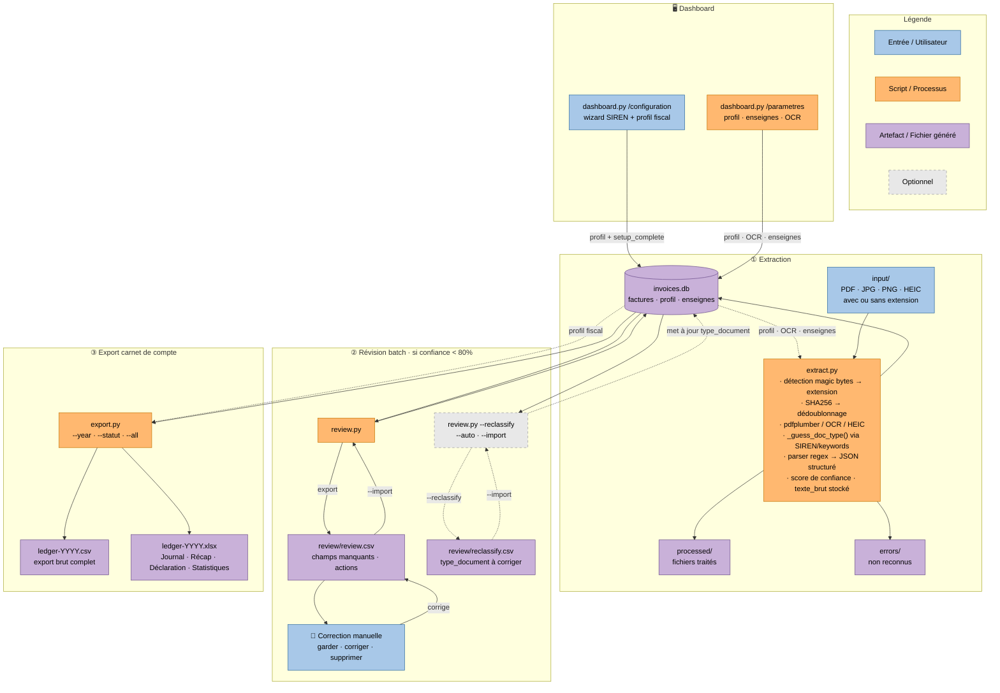
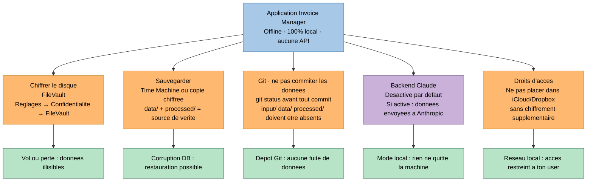

# Invoice Manager

Extraction et gestion de factures pour déclarations fiscales. Offline-first, multi-statut fiscal.

---

## Démarrage rapide

### Est-ce que j'ai besoin d'un dossier par statut fiscal ?

**Non.** Un seul dossier suffit si tu as une seule activité.

Le dossier de l'application (celui qui contient `run.py`) est aussi ton espace de travail : tu y déposes tes fichiers dans `input/`, la base SQLite y est créée, les exports y sont générés. Tu ne crées des dossiers supplémentaires que si tu as **plusieurs entreprises distinctes** à gérer en parallèle — voir la [FAQ](#faq) et la commande `init_workspace.py` ci-dessous.

---

### 1. Prérequis système

```bash
brew install tesseract tesseract-lang poppler
```

### 2. Dépendances Python

```bash
pip install pdfplumber pdf2image pytesseract Pillow openpyxl pillow-heif opencv-python-headless numpy
```

Optionnel — fallback OCR sur photos difficiles :

```bash
pip install easyocr
```

### 3. Initialiser ton espace de travail

Lance le dashboard et complète le wizard de setup (2 étapes) :

```bash
python3 dashboard.py   # http://localhost:7800
```

Le wizard demande ton SIREN et ton profil fiscal — c'est le minimum pour débloquer le dashboard et le pipeline CLI. Ton nom, TVA intracommunautaire, enseignes connues et paramètres OCR se configurent ensuite depuis **Paramètres** (`/parametres`).

### 4. Mettre à jour le ledger

```bash
# 1. Dépose tes fichiers dans input/
cp ~/Downloads/facture.pdf input/
cp ~/Downloads/photo_ticket.HEIC input/

# 2. Lance le pipeline
python3 run.py
```

C'est tout. `run.py` enchaîne trois étapes automatiquement :

1. **Déduplication** — compare les fichiers de `input/` par checksum SHA256 ; si deux fichiers sont identiques, conserve celui au nom le plus court et supprime les autres
2. **Extraction** — lit les fichiers de `input/`, parse les montants/dates/SIREN, insère en base, déplace dans `processed/`. Si le hash SHA-256 du fichier est déjà présent en base, le fichier est déplacé dans `duplicates/` (et non réingéré). Côté upload via le dashboard, un fichier dont le hash existe déjà est rejeté avant écriture disque avec la raison `déjà importé`.
3. **Export** — génère `output/ledger-YYYY.csv` et `output/ledger-YYYY.xlsx`

Les items avec confiance < 80 % sont marqués `à_réviser` et accessibles via le bouton **Révision** du dashboard.

```bash
# Options
python3 run.py --profile mon-ent             # cibler un profil spécifique (slug)
python3 run.py --profile mon-ent --year 2025 # forcer une année spécifique
```

**Scripts individuels** (pour usage avancé) :

```bash
python3 extract.py --profile mon-ent
python3 review.py --profile mon-ent                            # génère review.csv
python3 review.py --profile mon-ent --import                   # importe les corrections
python3 review.py --profile mon-ent --reclassify --auto        # reclassifie les types via texte OCR
python3 export.py --profile mon-ent --year 2025 --statut SASU  # export avec profil différent
```

---

## Configuration

### Paramètres utilisateur — Dashboard (`/parametres`)

Toutes les données utilisateur sont stockées dans la base SQLite et gérées depuis **Paramètres** dans le dashboard :

| Donnée | Section | Description |
|---|---|---|
| Photo de profil | Profil | JPG/PNG/WEBP — redimensionnée 256×256, stockée en base64 dans SQLite |
| SIREN | Profil | 9 chiffres — détecte automatiquement tes factures émises |
| Nom / raison sociale | Profil | Affiché dans l'en-tête du dashboard |
| TVA intracommunautaire | Profil | FR + 2 chiffres + SIREN |
| Profil fiscal | Fiscalité | `auto-entrepreneur` · `SASU` · `SARL` · `salarié` |
| Cadence déclaration | Fiscalité | Vide = cadence par défaut du profil. Les options proposées dépendent du statut fiscal sélectionné (voir `CADENCE_OPTIONS` dans `config.py`) |
| Enseignes connues | Enseignes | Mot-clé → nom canonique pour les tickets illisibles. La casse du mot-clé et du nom est préservée telle que saisie |
| Catégories TVA | Catégories TVA | Catégorie (ex. `transport`) → taux de TVA par défaut. Utilisé en fallback à l'extraction quand le taux ne peut pas être dérivé du document. Catégories toujours stockées en minuscules. Voir `docs/specs/2026-05-12-categories-tva.md` |
| Backend OCR | App | `local` (offline) uniquement — `claude` (Vision API) à venir |
| Seuil confiance | App | Sous lequel l'item passe en révision (défaut `0.8`) |
| Langue OCR | App | Langues Tesseract (défaut `fra+eng`) |
| DPI OCR | App | Résolution PDF→image (défaut `300`) |
| Preprocessing image | App | Denoise, perspective, binarisation, deskew |
| EasyOCR fallback | App | Fallback si confiance Tesseract insuffisante |
| Seuil EasyOCR | App | Ratio alphanumérique déclenchant le fallback (défaut `0.4`) |

---

## Formats supportés

| Format | Méthode d'extraction |
|---|---|
| PDF natif (OVH, SFR…) | pdfplumber — lecture texte natif, sans OCR |
| PDF scanné | pytesseract OCR (fallback si < 50 caractères natifs) |
| JPG / PNG / TIFF / BMP / WEBP | pytesseract OCR |
| HEIC / HEIF (photo iPhone) | pillow-heif + pytesseract OCR |
| Fichier sans extension | Détection automatique par magic bytes → renommage |

---

## Structure du projet

Le code est organisé en couches : pipeline CLI (lecture/écriture des fichiers), application Flask (entrée + factory + blueprints orientés domaine + services + queries), domaine partagé (DB, profils, parseurs, constantes), et templates Jinja.

```
invoice-manager/
│
├── ── Pipeline CLI ─────────────────────────────────────────────────────
├── run.py                  ← orchestrateur : dédoublonne → extrait → exporte
├── extract.py              ← lecture fichiers (PDF/OCR/HEIC) → DB
├── review.py               ← révision batch via review.csv (export/import)
├── export.py               ← génération ledger CSV + XLSX (4 onglets)
├── init_workspace.py       ← initialisation d'un nouvel espace de travail
│
├── ── Application web Flask ────────────────────────────────────────────
├── dashboard.py            ← point d'entrée CLI (argparse + app.run)
├── app.py                  ← factory : Flask(), blueprints, before_request, route /, filtres Jinja
├── context_helpers.py      ← helpers session/profil : active_slug, active_paths, active_db, get_profile
├── queries.py              ← lectures SQLite pures (KPI fiscaux, ledger, santé, corbeille, à réviser…)
│
├── services/               ← logique métier (couche domaine)
│   ├── __init__.py
│   ├── revision.py         ← workflow révision : _parse (ACL stricte : `date_document` + `date_paiement` ISO YYYY-MM-DD),
│   │                          _validate, _recompute_confidence, _build_log, _persist
│   └── comptabilite.py     ← sens débit/crédit + helper `date_encaissement(row)` (mouvement de trésorerie côté AE)
│
├── blueprints/             ← contextes bornés (DDD), un blueprint = un agrégat / un domaine
│   ├── __init__.py
│   ├── factures.py         ← Facture : PATCH /factures/<id>, DELETE /factures/<id>,
│   │                          POST /factures/<id>/{valider, restaurer, reinitialiser},
│   │                          POST /factures/{reinitialiser-revisions, ouvrir-revision}
│   ├── profils.py          ← Identité / onboarding : GET /profils, POST /profils,
│   │                          POST /profils/<slug>/activer, GET|POST /configuration
│   ├── parametres.py       ← Paramètres : GET /parametres, POST /parametres/profil,
│   │                          POST /parametres/enseignes, DELETE /parametres/enseignes/<id>,
│   │                          POST /parametres/categories-tva,
│   │                          DELETE /parametres/categories-tva/<id>, POST /parametres/ocr
│   └── pipeline.py         ← Ingestion + fichiers : POST /pipeline/{lancer, depot, purger-liens-morts},
│                              POST /pipeline/erreurs/<fn>/reessayer, DELETE /pipeline/erreurs/<fn>,
│                              GET /fichiers/<path>, GET /apercu/<path>
│
├── ── Domaine partagé ──────────────────────────────────────────────────
├── db.py                   ← schéma SQLite, migrations, helpers profil/OCR/enseignes
├── profiles.py             ← résolution des chemins par profil + migration legacy
├── parsers.py              ← regex et heuristiques d'extraction (dates, montants, SIREN, doc_type)
├── config.py               ← CADENCE_DEFAULTS + CADENCE_OPTIONS par statut fiscal
├── constants.py            ← constantes partagées (statuts, seuils, types de documents)
│
├── ── Vues Jinja ───────────────────────────────────────────────────────
├── templates/
│   ├── dashboard.html      ← vue principale du ledger (synthèse + onglets)
│   ├── settings.html       ← paramètres utilisateur (/parametres)
│   ├── setup.html          ← wizard /configuration (SIREN + profil fiscal)
│   ├── error.html          ← page d'erreur base de données
│   └── profils/
│       └── premiere_page.html ← page de bienvenue (avant tout profil créé)
│
├── ── Données par profil ───────────────────────────────────────────────
├── data/
│   └── profiles/
│       ├── entreprise-principale/
│       │   ├── invoices.db ← DB migrée automatiquement depuis data/invoices.db (legacy)
│       │   ├── input/       ← déposer les fichiers ici
│       │   ├── processed/   ← fichiers traités avec succès
│       │   ├── errors/      ← fichiers non reconnus
│       │   ├── duplicates/  ← fichiers déjà importés (hash trouvé en base)
│       │   ├── output/      ← exports CSV et XLSX
│       │   └── review/      ← review.csv pour révision batch
│       └── {slug}/         ← même structure pour chaque profil
│           └── invoices.db
│
├── ── Tests pytest (184 tests) ─────────────────────────────────────────
├── tests/
│   ├── conftest.py         ← fixtures partagées (tmp_db, tmp_project, make_pdf)
│   ├── test_config.py      ← CADENCE_DEFAULTS + CADENCE_OPTIONS par statut fiscal
│   ├── test_db.py          ← garde-fou migrations, PRAGMA user_version
│   ├── test_extract.py     ← OCR, parseurs, _guess_doc_type, magic bytes, dédoublonnage
│   ├── test_review.py      ← workflow CSV : export/import, actions, reclassify
│   ├── test_export.py      ← filtres année/statut, 4 onglets XLSX, calculs récap
│   ├── test_montants.py    ← derive_amounts : HT/TVA/TTC dérivés à l'affichage
│   ├── test_complete_amounts.py ← complete_amounts : règles HT/TVA/TTC + taux (fraction 0..1)
│   └── test_dashboard.py   ← routes Flask (PATCH/DELETE/POST), queries, services
│
├── demo/                   ← simulation pipeline complète (PDFs générés à la volée)
│   └── run_all.py          ← génère des PDFs synthétiques et vérifie chaque profil
│
└── sample-data/            ← fixtures PDF générées localement (input/ ignoré par git)
    ├── auto-entrepreneur/input/   ← facture_reçue · avoir · reçu
    ├── sasu/input/                ← facture_émise · facture_reçue · avoir_client · note_de_frais
    ├── sarl/input/                ← facture_émise · facture_reçue · avoir · note_de_frais
    ├── salarie/input/             ← note_de_frais · formation · reçu transport
    └── generate_fixtures.py       ← `python3 sample-data/generate_fixtures.py` pour générer/regénérer les PDFs
```

### Règle de dépendance

```
dashboard.py  →  app.py  →  blueprints/*
                            ↓
                            context_helpers.py · queries.py · services/* · db.py · profiles.py
```

Les couches basses (DB, parseurs, profils) **ne connaissent jamais** les couches hautes (blueprints, app). Les blueprints communiquent entre eux uniquement via les modules partagés (jamais d'import direct entre blueprints).
```

## Guides de développement

| Fichier | Contenu |
|---------|---------|
| [`BDD_PRACTICES.md`](BDD_PRACTICES.md) | Tests BDD prioritaires — Given/When/Then en langage ubiquitaire, spec exécutable, robustesse |
| [`DDD_PRACTICES.md`](DDD_PRACTICES.md) | Langage ubiquitaire, bounded contexts, agrégats, services, repository, ACL |
| [`CLEAN_CODE.md`](CLEAN_CODE.md) | Noms, SRP, fonctions courtes, gestion d'erreurs, code mort, AAA dans les tests |
| [`GOOD_PRACTICES.md`](GOOD_PRACTICES.md) | Bonnes pratiques Python (nommage, boucles, lisibilité) |
| [`ARCHITECTURE_PYTHON.md`](ARCHITECTURE_PYTHON.md) | Structure de projet, séparation des couches, outils |
| [`UI_DESIGN.md`](UI_DESIGN.md) | Lois de Gestalt, hiérarchie visuelle, couleurs, typographie, tableaux |
| [`UX_DESIGN.md`](UX_DESIGN.md) | Lois UX (Hick, Fitts, Miller…), formulaires, états vides, charge cognitive |
| [`ACCESSIBILITY.md`](ACCESSIBILITY.md) | WCAG 2.1 AA — contraste, clavier, ARIA, HTML sémantique, tests |

Ces guides s'appliquent à tout code ajouté ou modifié dans ce dépôt.
**Priorité des tests :** tests BDD fonctionnels (Given/When/Then) **d'abord** — ils attestent le design et servent de spécification exécutable. Les tests unitaires techniques viennent en complément.

---

### Rôle de chaque brique

**`run.py`** — orchestrateur. Lance les 3 étapes en séquence et gère la révision interactive : si des items ont une confiance < 80 %, ouvre `review.csv` dans le Finder, attend que tu le corriges, puis continue.

**`extract.py`** — lit chaque fichier de `input/`, détecte le format (magic bytes), extrait le texte (pdfplumber pour les PDF natifs, pytesseract OCR pour les images et PDF scannés), parse les champs (montants, dates, SIREN, TVA…), détecte le type de document (facture émise vs reçue, avoir, reçu, note de frais) via ton SIREN et des mots-clés, calcule un score de confiance, insère dans SQLite, et déplace le fichier dans `processed/` ou `errors/`.

**`review.py`** — exporte dans `review/review.csv` tous les items en attente de validation (`à_réviser`). Tu corriges le CSV, puis `--import` applique les changements et passe les items en `validé`. Le mode `--reclassify` permet de corriger uniquement le `type_document` en masse.

**`export.py`** — lit la base SQLite, filtre par année et statut fiscal, applique les règles de déductibilité (TVA déductible ou non selon le régime), et génère `ledger-YYYY.csv` + `ledger-YYYY.xlsx` avec 4 onglets : Journal, Récapitulatif, Déclaration, Statistiques (avec deadlines de déclaration calculées offline).

**`config.py`** — contient `CADENCE_DEFAULTS` (cadence par défaut par statut fiscal : `auto-entrepreneur` → trimestrielle, `SASU`/`SARL` → mensuelle, `salarié` → annuelle) et `CADENCE_OPTIONS` (cadences valides proposées dans Paramètres > Fiscalité, filtrées dynamiquement selon le statut fiscal sélectionné). Toutes les données utilisateur (identité, profil fiscal, OCR, enseignes) sont stockées en DB via `db.py`.

**`db.py`** — source de vérité pour le schéma SQLite. Gère les migrations (ALTER TABLE idempotentes), définit les tables `invoices`, `user_profile` et `known_emitters`. Expose `open_db(profile_slug)`, `get_user_profile()`, `get_known_emitters()` et `get_extraction_cfg()` — utilisés par tous les scripts. Chaque profil a sa propre DB sous `data/profiles/{slug}/invoices.db`. À la première ouverture, `data/invoices.db` (ancienne DB sans profil) est migrée automatiquement vers le profil `entreprise-principale`.

**`dashboard.py` + `app.py` + blueprints** — interface web Flask sur `http://localhost:7800`. Architecture en blueprints orientés domaine (DDD) avec URLs REST :

| Bounded context | Module | Routes principales |
|---|---|---|
| Identité / onboarding | `blueprints/profils.py` | `GET /profils`, `POST /profils`, `POST /profils/<slug>/activer`, `GET/POST /configuration` |
| Facture (agrégat) | `blueprints/factures.py` | `PATCH /factures/<id>`, `DELETE /factures/<id>`, `POST /factures/<id>/valider\|restaurer\|reinitialiser` |
| Paramètres | `blueprints/parametres.py` | `GET /parametres`, `POST /parametres/profil\|ocr\|enseignes`, `DELETE /parametres/enseignes/<id>` |
| Ingestion / fichiers | `blueprints/pipeline.py` | `POST /pipeline/lancer\|depot\|purger-liens-morts`, `GET /fichiers/<path>`, `GET /apercu/<path>` |

Wizard de configuration au premier lancement (`/configuration`) bloquant jusqu'à saisie du SIREN et du profil fiscal. Le bandeau "Profil incomplet" du dashboard ne se déclenche que si `nom` ou `siren` manque — le numéro de TVA intracommunautaire reste optionnel (les auto-entrepreneurs en franchise en base n'en ont pas). À la création d'un profil (`POST /profils`), `create_profile()` écrit directement `nom` et `created_at` dans `user_profile` (table SQLite du profil), pour que le header et **Paramètres → Mon profil** affichent l'entité immédiatement. La liste des profils est dérivée du scan de `data/profiles/*/` — aucun registre JSON externe. Page `/parametres` pour gérer le profil complet, les enseignes connues et les paramètres OCR ; la section **Fiscalité** filtre dynamiquement les cadences de déclaration selon le statut fiscal sélectionné. Sélecteur de profil dans le header (dropdown + switcher de contexte + "＋ Nouveau profil"). Bouton "⬆ Importer" pour l'upload multi-fichiers avec drag & drop (extraction en background) ; en cas d'échec d'enregistrement, un bloc `role="alert"` inline liste les fichiers refusés et leur cause. Édition inline du ledger, validation des items en révision, corbeille, pipeline one-click.

**`demo/run_all.py`** — génère des PDFs synthétiques à la volée avec fpdf, exécute le pipeline complet pour les 4 profils fiscaux, vérifie que la DB contient les bons types de documents et que les XLSX ont les 4 onglets attendus.

**`sample-data/`** — fixtures PDF générées localement par `generate_fixtures.py`. Les sous-dossiers `*/input/`, `*/processed/`, `*/data/` (etc.) sont ignorés par git afin de ne pas alourdir le dépôt. Avant la première utilisation :

```bash
python3 sample-data/generate_fixtures.py   # crée les PDFs (~45 fichiers)
```

Tu peux ensuite lancer `run.py` depuis un sous-dossier (`sample-data/sasu/`, etc.) pour tester chaque profil fiscal sans fournir tes propres documents.

---

## Architecture — Flow complet



> **Palette accessible daltoniens** — bleu (entrées), orange (scripts), violet (artefacts). Distinguable en deutéranopie et protanopie.

---

## Types de pièces et détection automatique

Le type de document est détecté automatiquement à l'extraction. Le texte brut est stocké en base pour permettre une reclassification ultérieure sans re-lire les fichiers.

| `type_document`   | Sens comptable                      | Signal de détection                               |
|-------------------|-------------------------------------|---------------------------------------------------|
| `facture_reçue`   | Charge fournisseur                  | Défaut (aucun autre signal)                        |
| `facture_émise`   | Produit / recette client            | Ton SIREN dans le corps du document                |
| `avoir_reçu`      | Remboursement fournisseur (−charge) | "avoir", "credit note", "note de crédit"           |
| `avoir_émis`      | Remboursement client (−CA)          | "avoir" + ton SIREN émetteur                       |
| `reçu`            | Charge sans facture formelle        | Pas de numéro de facture + montant TTC < 200 €     |
| `note_de_frais`   | Frais pro remboursés                | "note de frais", "remboursement de frais"          |
| `relevé_bancaire` | Réconciliation (hors ledger actif)  | "relevé de compte", "extrait de compte"            |
| `devis`           | Hors mouvement financier            | "devis", "cotation", "quote"                       |

Référentiel complet (déductibilité, règles par statut) → [`docs/types-pieces.md`](docs/types-pieces.md)

## Statuts fiscaux et cadences

| Statut             | Régime TVA            | Déclaration revenus                  | Cadence défaut | Cadences proposées             | Assujetti TVA |
|--------------------|-----------------------|--------------------------------------|----------------|--------------------------------|---------------|
| `auto-entrepreneur`| Franchise en base     | CA mensuel ou trimestriel (URSSAF)   | trimestrielle  | `mensuelle` · `trimestrielle`  | Non           |
| `SASU`             | Réel normal           | IS annuel (liasse fiscale)           | mensuelle      | `mensuelle` · `trimestrielle`  | Oui           |
| `SARL`             | Réel normal           | IS annuel (liasse fiscale)           | mensuelle      | `mensuelle` · `trimestrielle`  | Oui           |
| `salarié`          | N/A                   | IR annuel (DGFiP)                    | annuelle       | `annuelle`                     | Non           |

La cadence peut être surchargée depuis **Paramètres → Fiscalité** dans le dashboard ; seules les cadences cohérentes avec le statut fiscal sélectionné sont proposées.  
Les deadlines sont calculées offline et apparaissent dans l'onglet **Statistiques** du XLSX.

### Affichage UI selon le profil

Pour le profil **auto-entrepreneur** (et tout profil non assujetti à la TVA), l'UI du dashboard est simplifiée : aucune colonne TVA dans le Journal, un seul champ Montant dans les formulaires, la carte « TVA à reverser » de la synthèse fiscale est masquée. Les colonnes HT/TVA/TTC restent intactes en base de données pour audit, preuve et compatibilité avec un futur changement de régime.

La règle est portée par `services.profil.tva_visible_pour(profile)`, injectée dans Jinja (`app.jinja_env.globals`) et lue par les templates `dashboard.html`, `fragments/synthese_fiscale.html` et `settings.html`. Aujourd'hui elle équivaut à `FISCAL_RULES[profile.fiscal_profile]["tva_déductible"]` et retourne `False` pour `auto-entrepreneur` et `salarié`.

## Champs extraits

Chaque document produit jusqu'à 39 champs : numéro de facture, date, type de document, émetteur (SIREN, SIRET, TVA intracom, email, adresse), destinataire, montants (HT / TVA / TTC), devise, catégorie, taux de déductibilité, mode de paiement, exercice fiscal, trimestre, texte brut stocké, et métadonnées d'extraction (confiance, statut révision, hash).

### Convention `taux_tva` — fraction (0..1) sur 4 décimales

`taux_tva` est stocké comme **fraction** (ex. `0.20`, `0.055`, `0.021`) et non comme pourcentage. Les 4 décimales sont nécessaires pour préserver sans perte les taux réduit (5,5 %) et super-réduit (2,1 %) — impossible en 2 décimales (0.055 deviendrait 0.06). Les exports humains (XLSX, CSV `ledger-YYYY.csv`) multiplient par 100 pour l'affichage `TVA %` ; la base SQLite et le CSV `review.csv` conservent la fraction.

À la sauvegarde dans le dashboard, `services.montants.complete_amounts` complète automatiquement le 3ᵉ montant quand 2 de (HT, TVA, TTC) sont connus, ou les deux autres montants quand un seul + le taux sont fournis. Lorsque l'humain ne modifie qu'**un seul** des montants (HT, TVA ou TTC) — cas le plus courant : corriger le total d'une pièce —, `services.revision._propager_édition_partielle` recalcule les deux autres au prorata du taux (explicite ou implicite TVA/HT) pour que les totaux et la synthèse fiscale du ledger (basés sur `SUM(montant_ht)`) restent synchrones avec le document affiché. Une incohérence `HT + TVA ≠ TTC` (> 1 c) n'apparaît plus que pour une saisie multi-champs délibérée ; elle affiche alors un avertissement non démotant. L'extraction OCR reste strictement passive (aucune dérivation arithmétique) : seul ce qui est lu sur le document entre en DB.

### Règle des tickets simplifiés — TTC ≥ 150 € sans taux TVA

L'article 242 nonies A annexe II du CGI exige une mention explicite du taux et du montant de TVA sur toute facture au-dessus de **150 € TTC** pour ouvrir droit à déduction. Le dashboard applique cette règle automatiquement :

- **Profils `SASU` / `SARL`** : sauvegarder une facture validée à ≥ 150 € TTC sans `taux_tva` renseigné la rétrograde en *à réviser* avec un warning explicite. L'utilisateur choisit alors entre réclamer une facture conforme au fournisseur, ou accepter la non-déduction.
- **Profils `auto-entrepreneur` (franchise en base) / `salarié`** : la TVA n'est pas déductible de toute façon. La règle ne s'applique pas et le champ taux est masqué dans l'UI, remplacé par la mention *« TVA non applicable pour ce régime »*.
- **Tickets simplifiés (< 150 € TTC)** : aucune démotion automatique, conformément à la règle légale ; la mention TVA reste optionnelle sur le document.

Le seuil est défini par `SEUIL_TVA_SIMPLIFIEE_EUR` dans `constants.py`. Sous chaque champ taux, une mention rappelle à l'utilisateur que sans taux renseigné, la TVA ne sera pas considérée comme déductible — aucune valeur (notamment 20 %) n'est jamais assumée silencieusement par le système.

### Franchise en base — neutralisation automatique de la TVA sur les pièces émises

Art. 293 B CGI : un auto-entrepreneur en franchise (et a fortiori un salarié) ne peut pas facturer de TVA. Pour toute pièce **émise** par un profil dont `FISCAL_RULES[profil]["tva_déductible"] == False` (i.e. `auto-entrepreneur`, `salarié`), `services.montants.normaliser_tva_selon_profil` force avant écriture :

- `taux_tva = NULL`
- `montant_tva = 0`
- `montant_ttc = montant_ht` (les deux valeurs s'alignent sur celle effectivement lue)

La règle s'applique :
- à l'**extraction** (`extract.parse_invoice`) — un faux « 20 % » capté par l'OCR sur une facture émise par un AE n'entre jamais en DB ;
- à la **révision** (`PATCH /factures/<id>`) — empêche l'inférence arithmétique de ré-introduire une TVA fantôme.

Les pièces **reçues** (facture du fournisseur) ne sont pas touchées : la TVA portée par le fournisseur est conservée telle quelle ; sa non-déductibilité est gouvernée par le drapeau `déductible` au niveau de l'item.

## Output XLSX — 4 onglets

| Onglet | Contenu |
|---|---|
| Journal | **Livre-journal au format PCG** — Date, N° pièce, Émetteur, Libellé + 6 colonnes Débit/Crédit (HT, TVA, TTC). Ligne de totaux en bas. Filtres auto. |
| Récapitulatif | Total charges, CA, TVA, résultat net |
| Déclaration | Charges déductibles par catégorie pour déclaration fiscale |
| Statistiques | Décompte de pièces par mois/type, montants par mois, périodes de déclaration avec deadlines |

> **Format Journal** : conforme à la convention française (FEC art. A47 A-1 LPF, alignée Sage / EBP / Pennylane). Charges au débit, produits au crédit ; les avoirs apparaissent en contre-passation. Les pièces `relevé_bancaire` et `devis` sont exclues du livre-journal (elles restent dans le CSV).
>
> **CSV `ledger-YYYY.csv`** : registre plat des pièces (toutes lignes y compris off-ledger), enrichi d'une colonne `sens_comptable` (`débit` / `crédit` / vide). Format pensé pour scripts/tableurs ; pour la remise au comptable, utiliser le XLSX.

## Outils recommandés pour lire les fichiers générés

### CSV (`ledger-YYYY.csv`, `review.csv`)

| Outil | Contexte | Lien |
|---|---|---|
| **Rainbow CSV** | VS Code — coloration par colonne, requêtes SQL sur CSV | [marketplace](https://marketplace.visualstudio.com/items?itemName=mechatroner.rainbow-csv) |
| **CSV Editor** | JetBrains (IntelliJ, PyCharm…) — plugin officiel intégré | Preferences → Plugins → "CSV Editor" |
| **visidata** | Terminal — navigation interactive, stats, tri | `pip install visidata` puis `vd ledger-2025.csv` |
| **Numbers** | macOS — import natif, graphiques | Fourni avec macOS |
| **LibreOffice Calc** | Multiplateforme, gratuit | [libreoffice.org](https://www.libreoffice.org) |

### XLSX (`ledger-YYYY.xlsx`)

| Outil | Contexte | Lien |
|---|---|---|
| **Excel** | Référence — filtres, tableaux croisés | Microsoft 365 |
| **Numbers** | macOS — import XLSX natif | Fourni avec macOS |
| **Google Sheets** | En ligne, gratuit — import direct | [sheets.google.com](https://sheets.google.com) |
| **LibreOffice Calc** | Multiplateforme, gratuit | [libreoffice.org](https://www.libreoffice.org) |
| **Excel Viewer** | VS Code — aperçu XLSX sans quitter l'éditeur | [marketplace](https://marketplace.visualstudio.com/items?itemName=GrapeCity.gc-excelviewer) |

### SQLite (`data/profiles/{slug}/invoices.db`)

| Outil | Contexte | Lien |
|---|---|---|
| **SQLite Viewer** | VS Code — exploration sans quitter l'éditeur | [marketplace](https://marketplace.visualstudio.com/items?itemName=qwtel.sqlite-viewer) |
| **DB Browser for SQLite** | App desktop, requêtes, export | [sqlitebrowser.org](https://sqlitebrowser.org) |
| **DataGrip** | JetBrains — support natif SQLite | [jetbrains.com/datagrip](https://www.jetbrains.com/datagrip) |

---

## Tests

```bash
python3 -m pytest tests/ -v
```

184 tests — config, parsers, pipeline, edge cases, révision batch, reclassification, export, dashboard.

**Approche :** les tests BDD fonctionnels (Given/When/Then en langage ubiquitaire) sont la **première forme** de test et servent de spécification exécutable du domaine. Voir [`BDD_PRACTICES.md`](BDD_PRACTICES.md). Les tests unitaires techniques (parseurs, helpers purs) viennent en complément.

| Fichier | Ce qui est testé |
|---|---|
| `test_config.py` | `CADENCE_DEFAULTS` — valeurs par statut fiscal |
| `test_db.py` | Garde-fou des migrations, PRAGMA `user_version`, migration legacy DB |
| `test_extract.py` | `_parse_date`, `_parse_amount`, SIREN/SIRET/TVA, catégories, `_guess_doc_type`, pipeline complet, magic bytes, dédoublonnage, EasyOCR fallback |
| `test_review.py` | Export batch, import garder/corriger/supprimer, reclassify export/import/auto, cas limite (DB/CSV absents) |
| `test_export.py` | Filtres année/statut, colonnes CSV, 4 onglets XLSX, calculs récapitulatif, sheet Statistiques, deadlines |
| `test_dashboard.py` | Routes Flask (PATCH/DELETE /factures, POST /pipeline/*, /parametres/*), queries pures, services révision, édition inline, soft-delete, corbeille |

---

## Sécurité et données sensibles

**Données traitées :** SIREN, SIRET, TVA intracom, numéros de facture, montants, coordonnées émetteur/destinataire.  
**Connexions externes :** aucune. Le pipeline est 100% offline. Aucune API externe n'est appelée (sauf si `backend = "claude"` est activé explicitement).  
**Stockage :** tout reste local — SQLite + fichiers dans les dossiers configurés.

L'application en elle-même ne présente pas de risque : elle ne transmet rien, ne stocke rien en dehors de ton disque. Le risque est dans ce que **tu fais avec les fichiers**.



> **Palette accessible daltoniens** — bleu (app/neutre), orange (actions à faire), violet (mise en garde), vert (résultat attendu).

### Détails des actions

| Action | Commande / Chemin | Priorité |
|---|---|---|
| FileVault | Réglages système → Confidentialité et sécurité → FileVault | Critique |
| Time Machine | Préférences Time Machine → Sélectionner un disque | Haute |
| Vérifier Git | `git status` — `input/` `data/` `processed/` ne doivent pas apparaître | Haute |
| Backend Claude | Laisser `local` dans Paramètres → App (défaut) | Optionnel |
| Droits dossier | `ls -la ~/Documents/compta/` → doit appartenir à ton user uniquement | Recommandé |

### .gitignore — rappel

Le `.gitignore` fourni exclut déjà tous les dossiers de données. Seuls ces fichiers sont sûrs à versionner :

```
scripts (.py)   tests/   demo/   sample-data/   README.md   docs/
```

---

## Dashboard local

Lance un serveur web local pour visualiser les données en temps réel.

```bash
# Depuis ton dossier de travail (même que pour run.py)
python /chemin/vers/dashboard.py
# → http://localhost:7800
```

Options :

```bash
python dashboard.py --port 8080   # changer le port
```

Le dashboard affiche :
- **En-tête** : sélecteur de profil — dropdown listant toutes les entités, switcher de contexte instantané, bouton "＋ Nouveau profil". Le badge affiche la photo de profil (si uploadée) ou les initiales, le nom, profil fiscal et SIREN de l'entité active.
- **Import multi-fichiers** : bouton "⬆ Importer" ouvre une modale avec drag & drop — plusieurs PDF/images simultanément, extraction lancée en background, résultats visibles sans recharger la page. Extensions acceptées : `.pdf`, `.png`, `.jpg`, `.jpeg`, `.heic`, `.heif`, `.tif`, `.tiff`, `.webp`. Toute autre extension est rejetée avec un message "Extension de fichier non autorisée" avant tout accès disque (défense en profondeur, doublée d'un sniff magic bytes pour les binaires renommés).
- **Synthèse fiscale** : CA HT, TVA collectée/déductible/à reverser, total charges
  - *TVA déductible* : TVA payée sur vos achats fournisseurs — récupérable auprès de l'État
  - *TVA à reverser* : TVA collectée sur vos ventes − TVA déductible = montant net dû au fisc (négatif = crédit de TVA)
  - *Format des montants négatifs* : affichage avec signe `-` en préfixe (ex. `-1 234,56 €`), jamais entre parenthèses comptables
- **Santé** : fichiers en attente, items à valider, erreurs — toujours visible en haut de page. Chaque carte est cliquable (et focusable au clavier) **uniquement quand son compteur est ≥ 1** ; à 0 elle est affichée en état désactivé (atténuée, curseur par défaut, sans hover/focus ring, hors navigation Tab). Quand des liens de fichiers introuvables sur disque existent, une 4e carte **Liens morts** apparaît avec un compteur et un bouton de purge intégré — elle disparaît une fois la purge effectuée

Navigation par onglets (sous la synthèse) :
- **Ledger** : toutes les factures de l'année, paginées (50 / page), avec badge de statut par ligne. Le nom de fichier source est affiché en sous-texte de la colonne Fournisseur/Client (tronqué à 16 caractères + `…` + extension) — cliquable pour ouvrir la prévisualisation PDF. Les items `à_réviser` affichent un bouton **→ Réviser** dans la colonne Statut (toujours visible, sans survol). Chaque ligne affiche également 🔍 prévisualisation, 📥 téléchargement, et 🗑 suppression
- **À réviser (N)** : items non encore validés — édition directe dans le navigateur (9 champs : type, montants HT/TVA/TTC, date, émetteur, n° facture, catégorie, notes). La catégorie est un `<select>` alimenté par le référentiel *Paramètres › Catégories TVA* (option `(aucune)` en tête pour effacer ; les valeurs historiques absentes du référentiel sont préservées et signalées `(non enregistrée)`). Triés par **confiance décroissante** (items les plus proches du seuil de validation en premier ; NULL en fin de liste). Le titre de chaque carte (émetteur + date) est cliquable et ouvre la prévisualisation PDF inline. Onglet grisé et non cliquable si aucun item
- **Corbeille (N)** : documents supprimés avec date de suppression et bouton Restaurer. La restauration remet la facture **dans l'état exact où elle était au moment de la suppression** (un item `validé` revient `validé`, un item `à_réviser` revient `à_réviser`) — pour repasser explicitement en révision, utiliser le bouton « Réinitialiser » du ledger. Onglet grisé si vide
- **Erreurs (N)** : fichiers que l'extraction n'a pas pu traiter. Un fichier bascule en erreur quand (1) l'extraction lève une exception — texte vide après OCR, parsing impossible, magic bytes invalides — ou (2) le pipeline crashe avant la fin du job : un filet de sécurité bascule alors les lignes `en_attente` / `en_extraction` en `erreur` pour libérer le client. Le fichier est déplacé dans `errors/` avec un `message_erreur` attaché à `import_jobs`. Liste avec nom, taille, date, 🔍 prévisualisation. Actions par fichier : **↩ Réessayer** (remet dans `input/` et relance l'extraction en background), **✕ Supprimer** (suppression définitive avec confirmation). Onglet grisé si vide

L'onglet actif est persisté dans l'URL (`#ledger`, `#reviser`, `#corbeille`) — rechargement ou partage de lien restaure la vue.

- **Corrections tracées** : un document `validé` reste modifiable depuis le ledger (lien ✎), chaque correction est enregistrée dans un log horodaté (champ + valeur avant/après). Badge ✎ dans le ledger si des corrections existent
- **Suppression sécurisée** : le bouton Supprimer ouvre une modale de confirmation (`alertdialog` accessible) avant toute action. La suppression est un soft-delete — aucune suppression définitive possible depuis l'interface (obligation de conservation 10 ans, Code de commerce). Même comportement dans Paramètres → Enseignes connues
- **Retour visuel** : une notification toast non-bloquante confirme l'enregistrement du profil (Paramètres → Mon profil)

**Cycle de vie des statuts** :

| Statut | Déclencheur | Signification |
|---|---|---|
| `à_réviser` | Extraction — confiance < 80 % | Données incomplètes ou douteuses — action requise |
| `validé` | Extraction — confiance ≥ 80 % **ou** action manuelle | Données fiables ou certifiées par l'utilisateur |

- `à_réviser` → formulaire inline dans l'onglet "À réviser" (`révisé_par = 'user'`, passe en `validé`)
- `validé` → modifiable via le bouton ✎ dans le ledger — chaque modification est tracée (champ + valeur avant/après + horodatage)

Actions disponibles : lancer le pipeline, ouvrir `review.csv`, validation inline.

Prérequis : `pip install flask`

---

## Roadmap

- **Phase 1C** — ✅ Dashboard web local (`python dashboard.py` → http://localhost:7800)
- **Phase 1D** — Watcher automatique (surveille `input/` en continu, thread `watchdog` dans `dashboard.py`)
- **Phase 1E** — ✅ Actions complètes : révision inline dans le dashboard (sans passer par `review.csv`)
- **Phase 1E+** — Édition complète inline (40+ champs via panneau slide-over, sans CSV)
- **Phase 1F** — Déduplication sémantique (voir ci-dessous)
- **Phase 2** — Sync Notion API (push vers un board Notion structuré)

### Phase 1F — Déduplication sémantique

La déduplication actuelle est **structurelle** (SHA256 sur le fichier binaire). Elle couvre les cas simples mais pas ceux où un humain importe deux représentations différentes du même document.

#### Cas non couverts

| Cas | Raison de l'échec |
|---|---|
| Deux photos du même reçu (angles différents) | SHA256 différents |
| PDF + photo du même document | SHA256 différents |
| PDF re-téléchargé avec métadonnées mises à jour (horodatage, commentaire Adobe) | SHA256 différent à cause des métadonnées |
| PDF imprimé puis re-scanné | SHA256 différent, qualité OCR potentiellement dégradée |
| Même PDF converti dans un autre format (PDF → HEIC, PDF → PNG) | SHA256 différent |
| Même facture reçue en double par email (deux PDFs "identiques" visuellement mais générés séparément par le fournisseur) | SHA256 différents si le fournisseur a regénéré le fichier |

#### Solutions proposées (par ordre de fiabilité)

**1. Déduplication sur clé métier forte** *(recommandé, à implémenter en premier)*

Avant insertion, vérifier si une ligne existe déjà avec le même `(numéro_facture, émetteur_siren)`. Ce couple est unique par définition comptable — deux factures du même fournisseur ne peuvent pas avoir le même numéro.

```sql
SELECT id FROM invoices
WHERE numéro_facture = ? AND émetteur_siren = ?
  AND numéro_facture IS NOT NULL AND émetteur_siren IS NOT NULL
```

Limite : ne couvre pas les reçus sans numéro de facture (tickets de caisse, notes de frais photo).

**2. Déduplication floue sur triplet financier** *(filet de sécurité pour les reçus)*

Si la clé métier échoue (champs absents), vérifier le triplet `(montant_ttc ± 0,01 €, date_document, émetteur_nom ~=)`. Deux reçus du même montant, à la même date, du même émetteur sont très probablement le même document.

```sql
SELECT id FROM invoices
WHERE ABS(montant_ttc - ?) < 0.02
  AND date_document = ?
  AND émetteur_nom = ?
```

Limite : faux positifs possibles si un fournisseur émet deux factures identiques le même jour (rare mais légal).

**3. Flagging "suspect doublon" plutôt que blocage automatique**

Pour les cas ambigus (triplet financier match mais clé métier absente), ne pas bloquer l'insertion — insérer avec `statut_révision = 'suspect_doublon'` et afficher un avertissement dans le bloc santé du dashboard. L'utilisateur décide.

**4. Strip des métadonnées PDF avant hachage** *(optionnel, complexe)*

Utiliser `pikepdf` pour extraire uniquement le contenu visuel du PDF (sans métadonnées), puis hacher ce contenu normalisé. Couvre le cas "même PDF avec commentaire ajouté". Dépendance lourde, gain marginal.

#### Implémentation suggérée

1. Ajouter `_semantic_duplicate(conn, row) -> str | None` dans `extract.py` — retourne l'`id` du doublon existant si trouvé, sinon `None`.
2. Dans la boucle d'extraction : appeler après le SHA256 check, avant `insert()`.
3. Si doublon sémantique détecté : `[SKIP-SEM] doublon de {id_existant}` + déplacement dans `processed/` (pas `errors/`).
4. Ajouter `suspect_doublon` comme valeur de `statut_révision` + badge dédié dans le dashboard.

---

## FAQ

### J'ai 2 entreprises avec des statuts fiscaux différents — comment ça marche ?

C'est géré nativement depuis le dashboard — pas besoin de dossiers séparés.

Dans le header, le sélecteur de profil liste toutes tes entités. Clique sur **"＋ Nouveau profil"**, renseigne le SIREN et le profil fiscal — une nouvelle base SQLite est créée sous `data/profiles/{slug}/invoices.db`, totalement isolée.

```
data/profiles/
  entreprise-principale/   invoices.db   ← entité par défaut (migrée depuis data/invoices.db)
  ma-sasu/                 invoices.db
  mon-ae/                  invoices.db
```

Pour switcher : clique sur le dropdown dans le header — le contexte change instantanément (ledger, synthèse, révision). Les fichiers uploadés et le pipeline s'appliquent à l'entité active.

En CLI, passe le slug du profil :

```bash
python3 run.py --profile ma-sasu
python3 run.py --profile mon-ae --year 2025
```

---

### J'ai une facture en USD — comment indiquer le taux de change ?

Le champ `taux_change` dans la DB stocke le taux utilisé, et `montant_eur` le montant converti. Si l'extraction automatique ne trouve pas le taux (facture sans conversion), l'item est mis en révision (`confiance < 0.8`). Tu le corriges dans `review/review.csv` en renseignant `montant_eur` et `taux_change` manuellement.

---

### Le pipeline a re-traité un fichier déjà en base — pourquoi ?

Chaque fichier est dédoublonné par son hash SHA256. Si tu redéposes le même fichier dans `input/`, il est ignoré (log : `doublon ignoré`). En revanche, si le fichier a été modifié (re-téléchargé, re-exporté), son hash change et il est retraité. Les fichiers traités sont déplacés dans `processed/` avec leur hash en suffixe.

---

### Comment corriger une catégorie après coup sans re-extraire ?

Deux options :

1. **Via le dashboard** : clique ↩ sur la ligne concernée dans le ledger — l'item repasse en `à_réviser` et réapparaît dans la section de révision inline.
2. **Via review.csv** : mets le statut révision de l'item à `à_réviser` directement en SQL, puis relance `python3 review.py` pour l'exporter, corrige, et `--import`.
3. **Via SQLite** : ouvre `data/invoices.db` dans DB Browser for SQLite et modifie `catégorie`, `sous_catégorie`, `déductible`, `taux_déductibilité` directement.

Ensuite relance `python3 export.py` — l'export est idempotent (écrase les fichiers existants).

---

### L'OCR donne de mauvais résultats sur mes photos de tickets

Le pipeline applique automatiquement un pré-traitement en 4 étapes : dénoise bilateral (retire le grain sans flouter les contours), correction de perspective (redresse les tickets pris en angle), binarisation adaptative gaussienne (gère l'éclairage inégal et les ombres), et deskew. Deux passes Tesseract (PSM 3 + PSM 6) sont essayées si aucune date n'est détectée.

Si les résultats restent insuffisants :
- Vérifie que **Preprocessing image** est activé dans **Paramètres → App** du dashboard
- Augmente la résolution : **DPI OCR** → `400`
- Assure-toi que `tesseract-lang` est installé (`brew install tesseract-lang`)
- Active le fallback EasyOCR pour les photos vraiment difficiles (éclairage extrême, fort angle, ticket froissé) :
  ```bash
  pip install easyocr
  ```
  Puis dans **Paramètres → App** : active **EasyOCR fallback** et règle le **Seuil EasyOCR** à `0.4`.
  EasyOCR est plus lent (3–8s/image) mais bien meilleur sur fond complexe et texte incliné.
- Les items avec confiance < 0.8 atterrissent automatiquement en section "À réviser" dans le dashboard pour correction manuelle — le texte OCR brut y est visible pour diagnostiquer

---

### Puis-je utiliser Claude Vision au lieu de l'OCR local ?

Pas encore — l'option **Claude - Vision API** est prévue mais non implémentée. Elle apparaît grisée dans **Paramètres → App**. L'OCR local (`local`) est le seul backend disponible pour l'instant : offline, gratuit, sans envoi de données.

---

### Comment réinitialiser complètement la base ?

```bash
rm data/profiles/mon-profil/invoices.db
# Remet les fichiers dans input/ si besoin, puis :
python3 run.py --profile mon-profil
```

La base est recréée automatiquement au prochain lancement du pipeline. Pour réinitialiser tous les profils : `rm -rf data/profiles/`.
