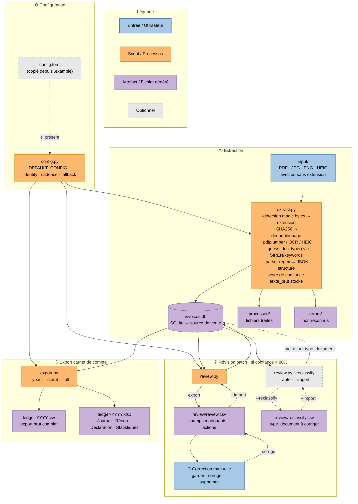
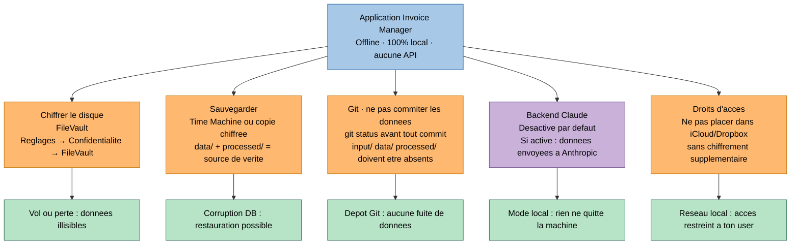

# Invoice Manager

Extraction et gestion de factures pour déclarations fiscales. Offline-first, multi-statut fiscal.

---

## Démarrage rapide

### Est-ce que j'ai besoin d'un dossier par statut fiscal ?

**Non.** Un seul dossier suffit si tu as une seule activité.

Le dossier de l'application (celui qui contient `run.py`) est aussi ton espace de travail : tu y déposes tes fichiers dans `input/`, la base SQLite y est créée, les exports y sont générés. Tu ne crées des dossiers supplémentaires que si tu as **plusieurs entreprises distinctes** à gérer en parallèle — voir la [FAQ](#faq) et la commande `init_workspace.py` ci-dessous.

---

### 1. Prérequis système

```bash
brew install tesseract tesseract-lang poppler
```

### 2. Dépendances Python

```bash
pip install pdfplumber pdf2image pytesseract Pillow openpyxl pillow-heif opencv-python-headless numpy
```

Optionnel — fallback OCR sur photos difficiles :

```bash
pip install easyocr
```

### 3. Initialiser ton espace de travail

**Cas simple — une seule activité :**

```bash
cp config.toml.example config.toml
```

**Cas multi-activités — créer un dossier dédié par entreprise :**

```bash
python3 init_workspace.py ~/Documents/compta-sasu
# → crée le dossier, copie config.toml.example, ouvre la config dans l'éditeur
# → affiche la commande exacte pour lancer le pipeline
```

Ouvre `config.toml` et renseigne ton identité et ton statut fiscal :

```toml
[identity]
nom          = "Jean Dupont"          # Nom / raison sociale
siren        = "123456789"            # 9 chiffres — détecte automatiquement tes factures émises
tva_intracom = "FR12123456789"        # FR + 2 chiffres + SIREN (laisser vide si non assujetti)

[fiscal]
default_profile     = "auto-entrepreneur"   # auto-entrepreneur | SASU | SARL | salarié
cadence_déclaration = ""                    # vide = cadence par défaut du profil
```

> Sans `config.toml`, le pipeline tourne avec les valeurs par défaut (utile pour tester).

### 4. Mettre à jour le ledger

```bash
# 1. Dépose tes fichiers dans input/
cp ~/Downloads/facture.pdf input/
cp ~/Downloads/photo_ticket.HEIC input/

# 2. Lance le pipeline
python3 run.py
```

C'est tout. `run.py` enchaîne quatre étapes automatiquement :

1. **Déduplication** — compare les fichiers de `input/` par checksum SHA256 ; si deux fichiers sont identiques, conserve celui au nom le plus court et supprime les autres
2. **Extraction** — lit les fichiers de `input/`, parse les montants/dates/SIREN, insère en base, déplace dans `processed/`
3. **Révision** *(si nécessaire)* — si des items ont une confiance < 80 %, ouvre `review/review.csv` dans le Finder, attend que tu le corriges et que tu appuies sur Entrée, puis importe les corrections
4. **Export** — génère `output/ledger-YYYY.csv` et `output/ledger-YYYY.xlsx`

```bash
# Options
python3 run.py --year 2025          # forcer une année spécifique
python3 run.py --config mon.toml    # utiliser une config différente
```

**Scripts individuels** (pour usage avancé) :

```bash
python3 extract.py                           # extraction seule
python3 review.py                            # génère review/review.csv
python3 review.py --import                   # importe les corrections
python3 review.py --reclassify --auto        # reclassifie les types via texte OCR
python3 export.py --year 2025 --statut SASU  # export avec profil différent
```

---

## Configuration (config.toml)

La configuration est le point d'entrée du workflow. Elle se fait une fois, au départ.

Priorité de résolution : **CLI args > config.toml > valeurs par défaut intégrées**

| Clé | Défaut | Description |
|---|---|---|
| `identity.siren` | `""` | Ton SIREN — permet de détecter tes factures émises automatiquement |
| `identity.nom` | `""` | Ton nom / raison sociale |
| `identity.tva_intracom` | `""` | Ton numéro TVA intracommunautaire |
| `extraction.backend` | `local` | `local` (offline) ou `claude` (Vision API) |
| `extraction.confidence_threshold` | `0.8` | Seuil sous lequel l'item va en révision |
| `extraction.ocr_lang` | `fra+eng` | Langues Tesseract |
| `extraction.ocr_dpi` | `300` | Résolution PDF→image pour l'OCR |
| `extraction.ocr_preprocess` | `true` | Preprocessing image (denoise, perspective, binarisation, deskew) |
| `extraction.ocr_easyocr_fallback` | `true` | Fallback EasyOCR si confiance Tesseract insuffisante — recommandé (`pip install easyocr`) |
| `extraction.ocr_easyocr_threshold` | `0.4` | Seuil de déclenchement EasyOCR (ratio alphanumérique, 0–1) |
| `fiscal.default_profile` | `auto-entrepreneur` | Profil fiscal — voir tableau statuts ci-dessous |
| `fiscal.cadence_déclaration` | `""` | Vide = cadence par défaut du profil (`trimestrielle` pour AE) |
| `paths.*` | `input/`, `output/`… | Tous les dossiers sont configurables |

### Enseignes connues (`[known_emitters]`)

Quand l'en-tête d'un ticket est illisible (froissé, coupé, mal éclairé), l'émetteur ne peut pas être détecté automatiquement. La section `[known_emitters]` permet d'associer un mot-clé — cherché n'importe où dans le texte OCR — à un nom d'enseigne :

```toml
[known_emitters]
boulanger = "Boulanger"
fnac      = "Fnac"
darty     = "Darty"
leroy     = "Leroy Merlin"
```

Le mot-clé est insensible à la casse. Il ne s'applique que si aucun émetteur n'a été détecté dans l'en-tête — il ne remplace jamais un nom déjà trouvé.

Toutes les clés sont optionnelles individuellement — seules les valeurs que tu surcharges sont nécessaires.
Voir `config.toml.example` pour la documentation complète et commentée de chaque option.

---

## Formats supportés

| Format | Méthode d'extraction |
|---|---|
| PDF natif (OVH, SFR…) | pdfplumber — lecture texte natif, sans OCR |
| PDF scanné | pytesseract OCR (fallback si < 50 caractères natifs) |
| JPG / PNG / TIFF / BMP / WEBP | pytesseract OCR |
| HEIC / HEIF (photo iPhone) | pillow-heif + pytesseract OCR |
| Fichier sans extension | Détection automatique par magic bytes → renommage |

---

## Structure du projet

```
0_INVOICES/
│
├── run.py                  ← point d'entrée unique (extract → review → export)
│
├── extract.py              ← brique 1 : lecture et structuration des fichiers
├── review.py               ← brique 2 : révision batch des extractions incertaines
├── export.py               ← brique 3 : génération du carnet de compte
├── config.py               ← chargement config + DEFAULT_CONFIG + fallback
│
├── config.toml.example     ← template versionné à copier
├── config.toml             ← ta configuration locale (non versionné)
│
├── input/                  ← déposer les fichiers ici
├── processed/              ← fichiers traités avec succès (auto-déplacés)
├── errors/                 ← fichiers non reconnus (révision manuelle)
├── review/
│   └── review.csv          ← items confiance < 80% à corriger manuellement
├── data/
│   └── invoices.db         ← SQLite, source de vérité
├── output/
│   ├── ledger-YYYY.csv     ← export brut complet
│   └── ledger-YYYY.xlsx    ← classeur 4 onglets
│
├── tests/                  ← suite pytest (101 tests)
│   ├── test_config.py
│   ├── test_extract.py
│   ├── test_review.py
│   └── test_export.py
│
├── demo/                   ← simulation pipeline complète (PDFs générés à la volée)
│   └── run_all.py          ← génère des PDFs synthétiques et vérifie chaque profil
│
└── sample-data/            ← fixtures PDF statiques (fichiers commités)
    ├── auto-entrepreneur/input/   ← facture_reçue · avoir · reçu
    ├── sasu/input/                ← facture_émise · facture_reçue · avoir_client · note_de_frais
    ├── sarl/input/                ← facture_émise · facture_reçue · avoir · note_de_frais
    ├── salarie/input/             ← note_de_frais · formation · reçu transport
    └── generate_fixtures.py       ← script pour regénérer les PDFs si besoin
```

### Rôle de chaque brique

**`run.py`** — orchestrateur. Lance les 3 étapes en séquence et gère la révision interactive : si des items ont une confiance < 80 %, ouvre `review.csv` dans le Finder, attend que tu le corriges, puis continue.

**`extract.py`** — lit chaque fichier de `input/`, détecte le format (magic bytes), extrait le texte (pdfplumber pour les PDF natifs, pytesseract OCR pour les images et PDF scannés), parse les champs (montants, dates, SIREN, TVA…), détecte le type de document (facture émise vs reçue, avoir, reçu, note de frais) via ton SIREN et des mots-clés, calcule un score de confiance, insère dans SQLite, et déplace le fichier dans `processed/` ou `errors/`.

**`review.py`** — exporte dans `review/review.csv` tous les items dont le score de confiance est sous le seuil (défaut 0.8). Tu corriges le CSV, puis `--import` applique les changements en base. Le mode `--reclassify` permet de corriger uniquement le `type_document` en masse (utile pour recatégoriser un stock existant).

**`export.py`** — lit la base SQLite, filtre par année et statut fiscal, applique les règles de déductibilité (TVA déductible ou non selon le régime), et génère `ledger-YYYY.csv` + `ledger-YYYY.xlsx` avec 4 onglets : Journal, Récapitulatif, Déclaration, Statistiques (avec deadlines de déclaration calculées offline).

**`config.py`** — charge `config.toml` et le merge sur `DEFAULT_CONFIG`. Priorité : CLI args > config.toml > defaults. Tous les champs sont optionnels — si le fichier est absent, les valeurs par défaut s'appliquent silencieusement.

**`demo/run_all.py`** — génère des PDFs synthétiques à la volée avec fpdf, exécute le pipeline complet pour les 4 profils fiscaux, vérifie que la DB contient les bons types de documents et que les XLSX ont les 4 onglets attendus.

**`sample-data/`** — fixtures PDF statiques : des vrais fichiers commités dans le repo, un par type de document et par profil. Permet de tester manuellement en lançant `run.py` depuis un sous-dossier, sans code à exécuter. Les PDFs sont générés par `generate_fixtures.py` (à relancer si les fixtures sont supprimées).

---

## Architecture — Flow complet



> **Palette accessible daltoniens** — bleu (entrées), orange (scripts), violet (artefacts). Distinguable en deutéranopie et protanopie.

---

## Types de pièces et détection automatique

Le type de document est détecté automatiquement à l'extraction. Le texte brut est stocké en base pour permettre une reclassification ultérieure sans re-lire les fichiers.

| `type_document`   | Sens comptable                      | Signal de détection                               |
|-------------------|-------------------------------------|---------------------------------------------------|
| `facture_reçue`   | Charge fournisseur                  | Défaut (aucun autre signal)                        |
| `facture_émise`   | Produit / recette client            | Ton SIREN dans le corps du document                |
| `avoir_reçu`      | Remboursement fournisseur (−charge) | "avoir", "credit note", "note de crédit"           |
| `avoir_émis`      | Remboursement client (−CA)          | "avoir" + ton SIREN émetteur                       |
| `reçu`            | Charge sans facture formelle        | Pas de numéro de facture + montant TTC < 200 €     |
| `note_de_frais`   | Frais pro remboursés                | "note de frais", "remboursement de frais"          |
| `relevé_bancaire` | Réconciliation (hors ledger actif)  | "relevé de compte", "extrait de compte"            |
| `devis`           | Hors mouvement financier            | "devis", "cotation", "quote"                       |

Référentiel complet (déductibilité, règles par statut) → [`docs/types-pieces.md`](docs/types-pieces.md)

## Statuts fiscaux et cadences

| Statut             | Régime TVA            | Déclaration revenus                  | Cadence défaut | Assujetti TVA |
|--------------------|-----------------------|--------------------------------------|----------------|---------------|
| `auto-entrepreneur`| Franchise en base     | CA mensuel ou trimestriel (URSSAF)   | trimestrielle  | Non           |
| `SASU`             | Réel normal           | IS annuel (liasse fiscale)           | mensuelle      | Oui           |
| `SARL`             | Réel normal           | IS annuel (liasse fiscale)           | mensuelle      | Oui           |
| `salarié`          | N/A                   | IR annuel (DGFiP)                    | annuelle       | Non           |

La cadence peut être surchargée via `config.toml` → `[fiscal] cadence_déclaration`.  
Les deadlines sont calculées offline et apparaissent dans l'onglet **Statistiques** du XLSX.

## Champs extraits

Chaque document produit jusqu'à 39 champs : numéro de facture, date, type de document, émetteur (SIREN, SIRET, TVA intracom, email, adresse), destinataire, montants (HT / TVA / TTC), devise, catégorie, taux de déductibilité, mode de paiement, exercice fiscal, trimestre, texte brut stocké, et métadonnées d'extraction (confiance, statut révision, hash).

## Output XLSX — 4 onglets

| Onglet | Contenu |
|---|---|
| Journal | Toutes les opérations chronologiques, colonnes figées, filtres auto |
| Récapitulatif | Total charges, CA, TVA, résultat net |
| Déclaration | Charges déductibles par catégorie pour déclaration fiscale |
| Statistiques | Décompte de pièces par mois/type, montants par mois, périodes de déclaration avec deadlines |

## Outils recommandés pour lire les fichiers générés

### CSV (`ledger-YYYY.csv`, `review.csv`)

| Outil | Contexte | Lien |
|---|---|---|
| **Rainbow CSV** | VS Code — coloration par colonne, requêtes SQL sur CSV | [marketplace](https://marketplace.visualstudio.com/items?itemName=mechatroner.rainbow-csv) |
| **CSV Editor** | JetBrains (IntelliJ, PyCharm…) — plugin officiel intégré | Preferences → Plugins → "CSV Editor" |
| **visidata** | Terminal — navigation interactive, stats, tri | `pip install visidata` puis `vd ledger-2025.csv` |
| **Numbers** | macOS — import natif, graphiques | Fourni avec macOS |
| **LibreOffice Calc** | Multiplateforme, gratuit | [libreoffice.org](https://www.libreoffice.org) |

### XLSX (`ledger-YYYY.xlsx`)

| Outil | Contexte | Lien |
|---|---|---|
| **Excel** | Référence — filtres, tableaux croisés | Microsoft 365 |
| **Numbers** | macOS — import XLSX natif | Fourni avec macOS |
| **Google Sheets** | En ligne, gratuit — import direct | [sheets.google.com](https://sheets.google.com) |
| **LibreOffice Calc** | Multiplateforme, gratuit | [libreoffice.org](https://www.libreoffice.org) |
| **Excel Viewer** | VS Code — aperçu XLSX sans quitter l'éditeur | [marketplace](https://marketplace.visualstudio.com/items?itemName=GrapeCity.gc-excelviewer) |

### SQLite (`data/invoices.db`)

| Outil | Contexte | Lien |
|---|---|---|
| **SQLite Viewer** | VS Code — exploration sans quitter l'éditeur | [marketplace](https://marketplace.visualstudio.com/items?itemName=qwtel.sqlite-viewer) |
| **DB Browser for SQLite** | App desktop, requêtes, export | [sqlitebrowser.org](https://sqlitebrowser.org) |
| **DataGrip** | JetBrains — support natif SQLite | [jetbrains.com/datagrip](https://www.jetbrains.com/datagrip) |

---

## Tests

```bash
python3 -m pytest tests/ -v
```

101 tests — config, parsers, pipeline, edge cases, révision batch, reclassification, export.

| Fichier | Ce qui est testé |
|---|---|
| `test_config.py` | Fallback sans fichier, config partielle, TOML invalide, fichier illisible, immutabilité des defaults, `CADENCE_DEFAULTS` |
| `test_extract.py` | `_parse_date`, `_parse_amount`, SIREN/SIRET/TVA, catégories, `_guess_doc_type`, pipeline complet, magic bytes, dédoublonnage |
| `test_review.py` | Export batch, import garder/corriger/supprimer, reclassify export/import/auto, cas limite (DB/CSV absents) |
| `test_export.py` | Filtres année/statut, colonnes CSV, 4 onglets XLSX, calculs récapitulatif, sheet Statistiques, deadlines |

---

## Sécurité et données sensibles

**Données traitées :** SIREN, SIRET, TVA intracom, numéros de facture, montants, coordonnées émetteur/destinataire.  
**Connexions externes :** aucune. Le pipeline est 100% offline. Aucune API externe n'est appelée (sauf si `backend = "claude"` est activé explicitement).  
**Stockage :** tout reste local — SQLite + fichiers dans les dossiers configurés.

L'application en elle-même ne présente pas de risque : elle ne transmet rien, ne stocke rien en dehors de ton disque. Le risque est dans ce que **tu fais avec les fichiers**.



> **Palette accessible daltoniens** — bleu (app/neutre), orange (actions à faire), violet (mise en garde), vert (résultat attendu).

### Détails des actions

| Action | Commande / Chemin | Priorité |
|---|---|---|
| FileVault | Réglages système → Confidentialité et sécurité → FileVault | Critique |
| Time Machine | Préférences Time Machine → Sélectionner un disque | Haute |
| Vérifier Git | `git status` — `input/` `data/` `processed/` ne doivent pas apparaître | Haute |
| Backend Claude | Laisser `backend = "local"` dans `config.toml` (défaut) | Optionnel |
| Droits dossier | `ls -la ~/Documents/compta/` → doit appartenir à ton user uniquement | Recommandé |

### .gitignore — rappel

Le `.gitignore` fourni exclut déjà tous les dossiers de données. Seuls ces fichiers sont sûrs à versionner :

```
config.toml.example   scripts (.py)   tests/   demo/   sample-data/   README.md   docs/
```

---

## Dashboard local

Lance un serveur web local pour visualiser les données en temps réel.

```bash
# Depuis ton dossier de travail (même que pour run.py)
python /chemin/vers/dashboard.py
# → http://localhost:7800
```

Options :

```bash
python dashboard.py --port 8080                       # changer le port
python dashboard.py --config ~/compta/config.toml
```

Le dashboard affiche :
- **Synthèse fiscale** : CA HT, TVA collectée/déductible/à reverser, total charges
- **Ledger** : toutes les factures de l'année, paginées (50 / page)
- **Santé** : fichiers en attente, items à réviser, erreurs
- **Révision inline** : si des items ont un score de confiance < 80 %, une section "À réviser" apparaît entre santé et actions — chaque item est éditable directement dans le navigateur (8 champs essentiels + suppression), sans passer par `review.csv`

Actions disponibles : lancer le pipeline, ouvrir `review.csv`, révision inline.

Prérequis : `pip install flask`

---

## Roadmap

- **Phase 1C** — ✅ Dashboard web local (`python dashboard.py` → http://localhost:7800)
- **Phase 1D** — Watcher automatique (surveille `input/` en continu, thread `watchdog` dans `dashboard.py`)
- **Phase 1E** — ✅ Actions complètes : révision inline dans le dashboard (sans passer par `review.csv`)
- **Phase 1E+** — Édition complète inline (40+ champs via panneau slide-over, sans CSV)
- **Phase 1F** — Déduplication sémantique (voir ci-dessous)
- **Phase 2** — Sync Notion API (push vers un board Notion structuré)

### Phase 1F — Déduplication sémantique

La déduplication actuelle est **structurelle** (SHA256 sur le fichier binaire). Elle couvre les cas simples mais pas ceux où un humain importe deux représentations différentes du même document.

#### Cas non couverts

| Cas | Raison de l'échec |
|---|---|
| Deux photos du même reçu (angles différents) | SHA256 différents |
| PDF + photo du même document | SHA256 différents |
| PDF re-téléchargé avec métadonnées mises à jour (horodatage, commentaire Adobe) | SHA256 différent à cause des métadonnées |
| PDF imprimé puis re-scanné | SHA256 différent, qualité OCR potentiellement dégradée |
| Même PDF converti dans un autre format (PDF → HEIC, PDF → PNG) | SHA256 différent |
| Même facture reçue en double par email (deux PDFs "identiques" visuellement mais générés séparément par le fournisseur) | SHA256 différents si le fournisseur a regénéré le fichier |

#### Solutions proposées (par ordre de fiabilité)

**1. Déduplication sur clé métier forte** *(recommandé, à implémenter en premier)*

Avant insertion, vérifier si une ligne existe déjà avec le même `(numéro_facture, émetteur_siren)`. Ce couple est unique par définition comptable — deux factures du même fournisseur ne peuvent pas avoir le même numéro.

```sql
SELECT id FROM invoices
WHERE numéro_facture = ? AND émetteur_siren = ?
  AND numéro_facture IS NOT NULL AND émetteur_siren IS NOT NULL
```

Limite : ne couvre pas les reçus sans numéro de facture (tickets de caisse, notes de frais photo).

**2. Déduplication floue sur triplet financier** *(filet de sécurité pour les reçus)*

Si la clé métier échoue (champs absents), vérifier le triplet `(montant_ttc ± 0,01 €, date_document, émetteur_nom ~=)`. Deux reçus du même montant, à la même date, du même émetteur sont très probablement le même document.

```sql
SELECT id FROM invoices
WHERE ABS(montant_ttc - ?) < 0.02
  AND date_document = ?
  AND émetteur_nom = ?
```

Limite : faux positifs possibles si un fournisseur émet deux factures identiques le même jour (rare mais légal).

**3. Flagging "suspect doublon" plutôt que blocage automatique**

Pour les cas ambigus (triplet financier match mais clé métier absente), ne pas bloquer l'insertion — insérer avec `statut_révision = 'suspect_doublon'` et afficher un avertissement dans le bloc santé du dashboard. L'utilisateur décide.

**4. Strip des métadonnées PDF avant hachage** *(optionnel, complexe)*

Utiliser `pikepdf` pour extraire uniquement le contenu visuel du PDF (sans métadonnées), puis hacher ce contenu normalisé. Couvre le cas "même PDF avec commentaire ajouté". Dépendance lourde, gain marginal.

#### Implémentation suggérée

1. Ajouter `_semantic_duplicate(conn, row) -> str | None` dans `extract.py` — retourne l'`id` du doublon existant si trouvé, sinon `None`.
2. Dans la boucle d'extraction : appeler après le SHA256 check, avant `insert()`.
3. Si doublon sémantique détecté : `[SKIP-SEM] doublon de {id_existant}` + déplacement dans `processed/` (pas `errors/`).
4. Ajouter `suspect_doublon` comme valeur de `statut_révision` + badge dédié dans le dashboard.

---

## FAQ

### J'ai 2 entreprises avec des statuts fiscaux différents — comment ça marche ?

Un dossier par entreprise. Chaque dossier est autonome : ses propres fichiers en entrée, sa propre base SQLite, son propre `config.toml`.

```bash
# Créer les deux dossiers en une commande chacun
python3 /chemin/vers/init_workspace.py ~/Documents/compta-sasu
python3 /chemin/vers/init_workspace.py ~/Documents/compta-ae
# → crée input/ data/ output/ processed/ errors/ review/ + config.toml dans chaque dossier
# → ouvre config.toml dans l'éditeur pour renseigner le SIREN et le profil fiscal
```

Résultat :

```
~/Documents/
  compta-sasu/
    input/   data/   output/   processed/   errors/   review/
    config.toml   ← profile = "SASU", siren = "222222222"
  compta-ae/
    input/   data/   output/   processed/   errors/   review/
    config.toml   ← profile = "auto-entrepreneur", siren = "111111111"
```

```bash
# Mise à jour entreprise 1
cd ~/Documents/compta-sasu && python3 /chemin/vers/run.py

# Mise à jour entreprise 2
cd ~/Documents/compta-ae && python3 /chemin/vers/run.py
```

`run.py` et `init_workspace.py` résolvent les chemins depuis leur emplacement — tu peux les appeler depuis n'importe quel dossier.

---

### J'ai une facture en USD — comment indiquer le taux de change ?

Le champ `taux_change` dans la DB stocke le taux utilisé, et `montant_eur` le montant converti. Si l'extraction automatique ne trouve pas le taux (facture sans conversion), l'item est mis en révision (`confiance < 0.8`). Tu le corriges dans `review/review.csv` en renseignant `montant_eur` et `taux_change` manuellement.

---

### Le pipeline a re-traité un fichier déjà en base — pourquoi ?

Chaque fichier est dédoublonné par son hash SHA256. Si tu redéposes le même fichier dans `input/`, il est ignoré (log : `doublon ignoré`). En revanche, si le fichier a été modifié (re-téléchargé, re-exporté), son hash change et il est retraité. Les fichiers traités sont déplacés dans `processed/` avec leur hash en suffixe.

---

### Comment corriger une catégorie après coup sans re-extraire ?

Deux options :

1. **Via review.csv** : mets le statut révision de l'item à `à_réviser` directement en SQL, puis relance `python3 review.py` pour l'exporter, corrige, et `--import`.
2. **Via SQLite** : ouvre `data/invoices.db` dans DB Browser for SQLite et modifie `catégorie`, `sous_catégorie`, `déductible`, `taux_déductibilité` directement.

Ensuite relance `python3 export.py` — l'export est idempotent (écrase les fichiers existants).

---

### L'OCR donne de mauvais résultats sur mes photos de tickets

Le pipeline applique automatiquement un pré-traitement en 4 étapes : dénoise bilateral (retire le grain sans flouter les contours), correction de perspective (redresse les tickets pris en angle), binarisation adaptative gaussienne (gère l'éclairage inégal et les ombres), et deskew. Deux passes Tesseract (PSM 3 + PSM 6) sont essayées si aucune date n'est détectée.

Si les résultats restent insuffisants :
- Vérifie que `ocr_preprocess = true` est dans `config.toml`
- Augmente la résolution : `ocr_dpi = 400`
- Assure-toi que `tesseract-lang` est installé (`brew install tesseract-lang`)
- Active le fallback EasyOCR pour les photos vraiment difficiles (éclairage extrême, fort angle, ticket froissé) :
  ```bash
  pip install easyocr
  ```
  Puis dans `config.toml` :
  ```toml
  ocr_easyocr_fallback = true
  ocr_easyocr_threshold = 0.4  # déclencher si < 40 % alphanumérique
  ```
  EasyOCR est plus lent (3–8s/image) mais bien meilleur sur fond complexe et texte incliné.
- Les items avec confiance < 0.8 atterrissent automatiquement en section "À réviser" dans le dashboard pour correction manuelle — le texte OCR brut y est visible pour diagnostiquer

---

### Puis-je utiliser Claude Vision au lieu de l'OCR local ?

Oui : `backend = "claude"` dans `config.toml`. Requiert une clé API Anthropic (`ANTHROPIC_API_KEY` en variable d'environnement). L'OCR local (`backend = "local"`) reste le défaut — offline, gratuit, sans envoi de données.

---

### Comment réinitialiser complètement la base ?

```bash
rm data/invoices.db
# Remet les fichiers dans input/ si besoin, puis :
python3 run.py
```

La base est recréée automatiquement au prochain `extract.py`.
