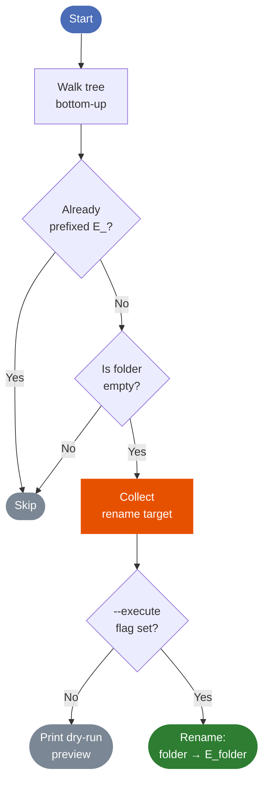

# mark-empty-folders

Recursively scans a directory tree and renames empty folders by prefixing them with `E_`.

## Why

Cloud storage tools (Google Drive, OneDrive, Dropbox) silently drop empty folders on sync — they simply don't exist on the other side. This script makes them visible and survives round-trips by marking them with a prefix instead of a placeholder file.

## What

- Walks a directory tree bottom-up
- Identifies folders that are truly empty (no files, no subdirectories)
- Ignores OS noise files: `.DS_Store`, `desktop.ini`, `thumbs.db`
- Renames them from `folder-name` → `E_folder-name`
- Skips folders already prefixed with `E_`
- Defaults to **dry run** — nothing is changed unless you pass `--execute`

## How it works



**Legend**

| Shape / Color | Meaning |
|---|---|
| Rounded rect, blue `#4B6CB7` | Entry / exit point |
| Diamond, white | Decision |
| Rectangle, orange `#E65100` | Side-effect (collect rename) |
| Rounded rect, green `#2E7D32` | Destructive action (actual rename) |
| Rounded rect, grey `#7B8794` | No-op / read-only output |

> Colors chosen for deuteranopia / protanopia safety: blue, orange, green, and grey are distinguishable without red-green perception.

## Usage

```bash
# Dry run (default) — preview what would be renamed
python mark_empty_folders.py /path/to/target

# Actually rename
python mark_empty_folders.py /path/to/target --execute

# Treat .DS_Store etc. as real files (strict mode)
python mark_empty_folders.py /path/to/target --no-ignore-hidden

# Combine
python mark_empty_folders.py /path/to/target --execute --no-ignore-hidden
```

## Project structure

```
mark-empty-folders/
└── mark_empty_folders.py   # single-file script, no dependencies beyond stdlib
```

## Requirements

Python 3.6+. No third-party packages.
