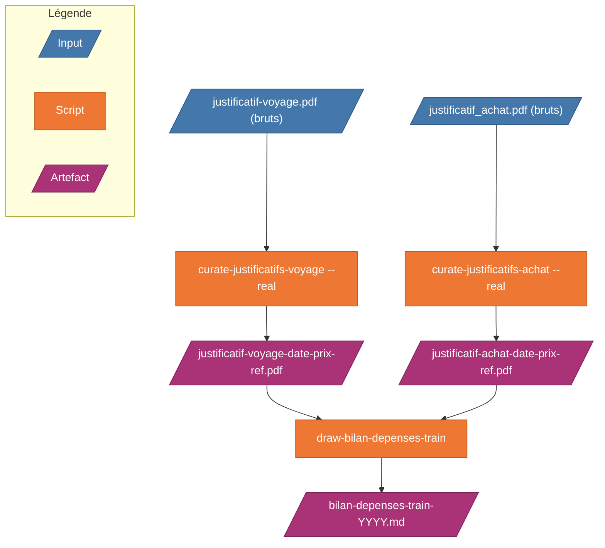

# sncf-trip-proofs

Outils pour déclarer les frais de train au réel, à partir des justificatifs SNCF Connect.

Pour déclarer des frais de train au réel, il faut fournir chaque justificatif avec sa date, son montant et sa référence — et totaliser le tout par mois. SNCF Connect livre des fichiers avec des noms inutilisables (`JustificatifAchat_SNCFCONNECT.pdf`) : impossible de savoir sans les ouvrir à quoi ils correspondent.

Ces outils lisent chaque justificatif, en extraient automatiquement la date, le montant et la référence, renomment les fichiers en conséquence, puis produisent un récapitulatif prêt à soumettre.



> **Affichage en local** — VS Code : extension [Markdown Preview Mermaid Support](https://marketplace.visualstudio.com/items?itemName=bierner.markdown-mermaid) + `Cmd+Shift+V`. JetBrains : preview Markdown intégrée.

---

## Comment utiliser (ordre d'exécution)

### Prérequis (une seule fois)

**Dépendances système** (OCR + rendu PDF) :

```bash
# macOS
brew install tesseract tesseract-lang poppler

# Debian / Ubuntu
sudo apt install tesseract-ocr tesseract-ocr-fra poppler-utils
```

**Dépendances Python** (venv recommandé pour isoler et reproduire) :

```bash
cd sncf-trip-proofs
python3 -m venv .venv
source .venv/bin/activate
pip install -r requirements.txt
```

À chaque nouvelle session terminal : `source .venv/bin/activate` avant de
lancer les scripts. Le `.venv/` est local au repo et ignoré par git.

### Étape 1 — Configurer les chemins (une seule fois)

Copiez le template de configuration et renseignez les chemins vers vos dossiers existants :

```bash
cp sncf-trip-proofs/config.example.json sncf-trip-proofs/config.json
```

Éditez `config.json` avec vos chemins réels :

```json
{
  "curate-justificatifs-voyage": {
    "in": "/Users/alice/Documents/sncf/bruts-voyage",
    "out": "/Users/alice/Documents/sncf/renommes-voyage"
  },
  "curate-justificatifs-achat": {
    "in": "/Users/alice/Documents/sncf/bruts-achat",
    "out": "/Users/alice/Documents/sncf/renommes-achat"
  },
  "draw-bilan-depenses-train": {
    "in": "/Users/alice/Documents/sncf/renommes-achat",
    "out": "/Users/alice/Documents/sncf/bilans"
  }
}
```

Les dossiers `in` et `out` sont créés automatiquement si besoin. Les fichiers sources ne sont **jamais modifiés**.

### Étape 2 — Organiser les justificatifs

Choisir le script selon le type de fichier téléchargé depuis SNCF Connect :

```bash
# Justificatifs d'achat (JustificatifAchat_SNCFCONNECT.pdf)
python3 sncf-trip-proofs/curate-justificatifs-achat/curate-justificatifs-achat.py          # dry-run — vérifie les noms
python3 sncf-trip-proofs/curate-justificatifs-achat/curate-justificatifs-achat.py --real   # applique

# Justificatifs de voyage (justificatif-voyage-*.pdf)
python3 sncf-trip-proofs/curate-justificatifs-voyage/curate-justificatifs-voyage.py          # dry-run — vérifie les noms
python3 sncf-trip-proofs/curate-justificatifs-voyage/curate-justificatifs-voyage.py --real   # applique
```

### Étape 3 — Générer le bilan

```bash
python3 sncf-trip-proofs/draw-bilan-depenses-train/draw-bilan-depenses-train.py
```

Le bilan `bilan-depenses-train-YYYY.md` est généré dans le dossier `out` configuré.

---

### Sans configuration (usage ponctuel)

Sans `config.json`, les scripts utilisent des chemins par défaut relatifs à leur propre dossier :

```bash
# Déposer les PDFs dans inbox/, lancer depuis le dossier du script
cd sncf-trip-proofs/curate-justificatifs-achat/
python3 curate-justificatifs-achat.py          # dry-run
python3 curate-justificatifs-achat.py --real   # applique dans output/
cd ..

# Bilan depuis un dossier explicite
python3 draw-bilan-depenses-train/draw-bilan-depenses-train.py curate-justificatifs-achat/output/ ./bilans/
```

---

## Workflow zéro copier-coller avec un dossier cloud synchronisé

Si vos justificatifs vivent sur un cloud (Google Drive, Dropbox, iCloud Drive,
OneDrive…), pointez `config.json` directement sur le dossier monté localement
par le client desktop. Les scripts lisent/écrivent dans le cloud sans copie
manuelle.

### Exemple — Google Drive for Desktop

1. **Installer le client** : <https://www.google.com/drive/download/>, se
   connecter, choisir **« Streamer les fichiers »** (économise du disque).
2. **Localiser le point de montage** :
   - macOS récent : `~/Library/CloudStorage/GoogleDrive-<email>/Mon Drive/`
   - macOS ancien : `/Volumes/GoogleDrive/Mon Drive/`
   - Windows : `G:\Mon Drive\`
3. **Créer la structure** dans le Drive (Finder/Explorer ou navigateur) :
   ```
   Justificatifs SNCF/
   ├── inbox/      ← PDFs bruts téléchargés depuis SNCF Connect
   ├── curated/    ← PDFs renommés (output des scripts curate-*)
   └── bilans/     ← bilans .md (output de draw-bilan-*)
   ```
4. **Marquer offline** : clic droit sur `Justificatifs SNCF/` →
   « Disponible hors connexion ». Sans ça, Tesseract OCR re-télécharge chaque
   PDF à chaque accès, lent et fragile.
5. **Configurer le navigateur** pour télécharger directement dans `inbox/` :
   - Chrome/Brave : Réglages → Téléchargements → Emplacement
   - Safari : Réglages → Général → Emplacement de téléchargement
   - Firefox : Réglages → Général → Fichiers et applications
6. **Éditer `config.json`** avec les chemins du Drive :
   ```json
   {
     "curate-justificatifs-achat": {
       "in":  "/Users/<vous>/Library/CloudStorage/GoogleDrive-<email>/Mon Drive/Justificatifs SNCF/inbox",
       "out": "/Users/<vous>/Library/CloudStorage/GoogleDrive-<email>/Mon Drive/Justificatifs SNCF/curated"
     },
     "curate-justificatifs-voyage": { "in": "...inbox", "out": "...curated" },
     "draw-bilan-depenses-train":   { "in": "...curated", "out": "...bilans" }
   }
   ```

À partir de là : télécharger un PDF SNCF → il atterrit dans le Drive → lancer
les scripts depuis le venv → outputs synchronisés automatiquement.

### Alternative — Dropbox / iCloud Drive / OneDrive

Même principe, seul le point de montage change :

| Provider | Point de montage typique (macOS) | Garder offline |
|---|---|---|
| Dropbox | `~/Dropbox/` | Préférences → Sync → « Sync sélective » → tout cocher |
| iCloud Drive | `~/Library/Mobile Documents/com~apple~CloudDocs/` | Décocher « Optimiser stockage Mac » |
| OneDrive | `~/OneDrive/` | Clic droit → « Toujours conserver sur cet appareil » |

Adapter les chemins dans `config.json` au point de montage du client choisi.
Les étapes 3 à 6 ci-dessus restent valables à l'identique.

### Automatiser le run (optionnel)

Pour éviter même de taper la commande, un wrapper shell idempotent qui exécute
les 3 scripts à la suite et archive `inbox/` après run pour ne pas re-traiter
les mêmes PDFs :

```bash
#!/usr/bin/env bash
# ~/.local/bin/sncf-run.sh — adapter REPO et DRIVE puis chmod +x
set -euo pipefail
REPO="$HOME/Projects/toolbox/sncf-trip-proofs"
DRIVE="${SNCF_DRIVE:-$HOME/Library/CloudStorage/GoogleDrive-<email>/Mon Drive/Justificatifs SNCF}"
INBOX="$DRIVE/inbox"
ARCHIVE="$DRIVE/archive/$(date +%Y-%m)"

mapfile -t FILES < <(find "$INBOX" -maxdepth 1 -type f -name '*.pdf')
[[ ${#FILES[@]} -eq 0 ]] && { echo "inbox vide"; exit 0; }

cd "$REPO"
[[ -x "$REPO/.venv/bin/python3" ]] && PY="$REPO/.venv/bin/python3" || PY="python3"
"$PY" curate-justificatifs-achat/curate-justificatifs-achat.py --real
"$PY" curate-justificatifs-voyage/curate-justificatifs-voyage.py --real
"$PY" draw-bilan-depenses-train/draw-bilan-depenses-train.py

mkdir -p "$ARCHIVE"
for f in "${FILES[@]}"; do mv "$f" "$ARCHIVE/"; done
```

Propriétés du wrapper :
- **Snapshot avant run** : un PDF ajouté pendant l'exécution n'est pas archivé
  par erreur, il sera traité au run suivant.
- **Archive uniquement si tout réussit** (`set -e`) : un crash préserve les
  sources, on relance, les doublons côté `curated/` sont détectés
  automatiquement (cf. tableau « Cas particuliers » plus bas).
- **Venv auto-détecté** : utilise `.venv/bin/python3` si présent, sinon
  `python3` du `PATH`.

---

## Structure du projet

```
sncf-trip-proofs/
├── curate-justificatifs-achat/          ← organise les justificatifs d'achat
│   ├── inbox/                           ← déposer les PDFs bruts d'achat ici
│   ├── output/                          ← PDFs renommés (vidé et recréé à chaque --real)
│   ├── curate-justificatifs-achat.py    ← script d'organisation
│   ├── docs/specs/                      ← spécifications internes
│   └── README.md                        ← doc détaillée (formats, comportement, dépannage)
│
├── curate-justificatifs-voyage/         ← organise les justificatifs de voyage
│   ├── inbox/                           ← déposer les PDFs bruts de voyage ici
│   ├── output/                          ← PDFs renommés (vidé et recréé à chaque --real)
│   ├── curate-justificatifs-voyage.py   ← script d'organisation
│   ├── docs/specs/                      ← spécifications internes
│   └── README.md                        ← doc détaillée (formats, comportement, dépannage)
│
├── draw-bilan-depenses-train/           ← génère le bilan chiffré
│   ├── draw-bilan-depenses-train.py     ← script de génération du bilan Markdown
│   └── docs/specs/                      ← spécifications internes
│
└── README.md                            ← ce fichier
```

---

## Formats de noms produits

### Justificatifs d'achat (`curate-justificatifs-achat`)

```
justificatif-achat-<DATES>-<PRIX>-<REF>[-N].pdf
```

```
20260402_0701_JustificatifAchat_SNCFCONNECT.pdf
    → justificatif-achat-20260402-18-50ttc-1917346212-20260504.pdf

20260423_JustificatifAchat_SNCFCONNECT.pdf   (4 tickets, 2 jours)
    → justificatif-achat-20260423-20260424-57-00ttc-1480540391-20260504.pdf
```

### Justificatifs de voyage (`curate-justificatifs-voyage`)

```
justificatif-voyage-<DATE>-<PRIX>-<REF>[-<TCN>][-N].pdf
```

```
justificatif-voyage-brut.pdf
    → justificatif-voyage-20260402-18-50ttc-ne3erm-016487606.pdf
```

---

## Sortie du bilan (exemple console)

```
Lecture de : /…/curate-justificatifs-voyage/output
22 fichier(s) PDF trouvé(s)

✓ 22 trajet(s) extrait(s) depuis 22 ticket(s)

── Détail des trajets ──────────────────────────────

  16/03/2026  (1 trajet(s) — 15,60 €)
    • [calc] 15,60 €  ←  justificatif-voyage-20260316-15-60ttc-D56qej.pdf

  02/04/2026  (2 trajet(s) — 37,00 €)
    • [calc] 18,50 €  ←  justificatif-voyage-20260402-18-50ttc-ne3erm-016487606.pdf
    • [calc] 18,50 €  ←  justificatif-voyage-20260402-18-50ttc-ne3t6x-016487554.pdf
  …

✓ Bilan généré : bilan-depenses-train-2026.md
  → /…/curate-justificatifs-voyage/output/bilan-depenses-train-2026.md
```

`[PDF]` = prix extrait du PDF (multi-tickets achat). `[calc]` = montant du nom de fichier.

---

## Cas particuliers

| Situation | Comportement |
|---|---|
| PDF illisible (corrompu) | Erreur en console + listé dans le bilan |
| Nom non reconnu | Tentative fallback lecture PDF |
| Champ manquant après fallback | Erreur en console + listé dans le bilan |
| Dossier IN vide | Message "Rien à traiter", pas de fichier généré |
| Plusieurs années mélangées | Un fichier bilan par année |
| Fichiers non-PDF dans IN | Ignorés silencieusement |
| Deux sources au contenu identique | `[DOUBLON SOURCE]` — seul le plus ancien est gardé |
| Deux fichiers → même nom cible | `[CONFLIT NOM]` — checksum puis numérotation `_1`, `_2`, … |
| Même commande achat re-téléchargée | `[DOUBLON]` dans le bilan — second fichier ignoré |
