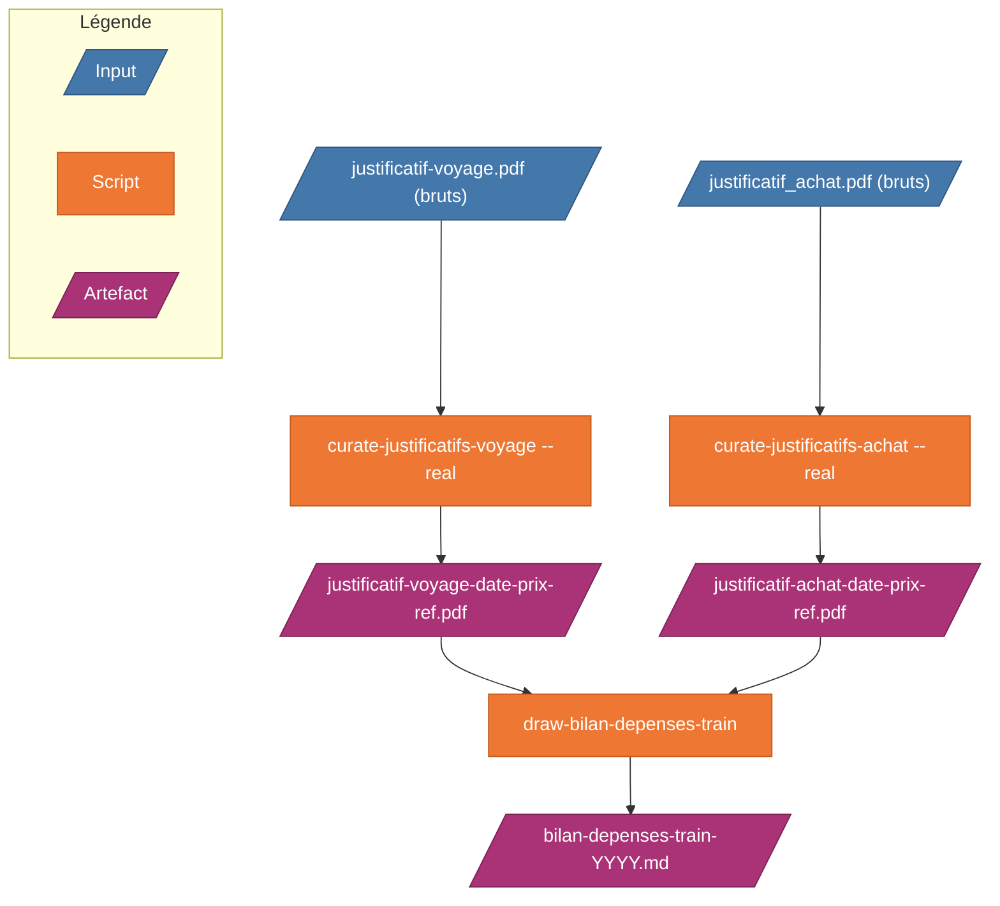

# sncf-trip-proofs

Outils pour déclarer les frais de train au réel, à partir des justificatifs SNCF Connect.

Pour déclarer des frais de train au réel, il faut fournir chaque justificatif avec sa date, son montant et sa référence — et totaliser le tout par mois. SNCF Connect livre des fichiers avec des noms inutilisables (`JustificatifAchat_SNCFCONNECT.pdf`) : impossible de savoir sans les ouvrir à quoi ils correspondent.

Ces outils lisent chaque justificatif, en extraient automatiquement la date, le montant et la référence, renomment les fichiers en conséquence, puis produisent un récapitulatif prêt à soumettre.



> **Affichage en local** — VS Code : extension [Markdown Preview Mermaid Support](https://marketplace.visualstudio.com/items?itemName=bierner.markdown-mermaid) + `Cmd+Shift+V`. JetBrains : preview Markdown intégrée.

---

## Comment utiliser (ordre d'exécution)

### Prérequis (une seule fois)

```bash
brew install tesseract tesseract-lang poppler
pip3 install pdfplumber pdf2image pytesseract Pillow
```

### Étape 1 — Déposer les PDFs bruts

```bash
cp ~/Downloads/*.pdf curate-justificatifs-achat/inbox/
# ou
cp ~/Downloads/*.pdf curate-justificatifs-voyage/inbox/
```

### Étape 2 — Organiser les justificatifs

Choisir le type de justificatif selon les fichiers téléchargés depuis SNCF Connect :

```bash
# Justificatifs d'achat (JustificatifAchat_SNCFCONNECT.pdf)
cd curate-justificatifs-achat/
python3 curate-justificatifs-achat.py          # dry-run — vérifie les noms générés
python3 curate-justificatifs-achat.py --real   # applique — copie dans output/
cd ..

# Justificatifs de voyage (justificatif-voyage-*.pdf)
cd curate-justificatifs-voyage/
python3 curate-justificatifs-voyage.py          # dry-run — vérifie les noms générés
python3 curate-justificatifs-voyage.py --real   # applique — copie dans output/
cd ..
```

Les fichiers sources dans `inbox/` ne sont **jamais modifiés**.

### Étape 3 — Générer le bilan

```bash
# Depuis les justificatifs d'achat
python3 draw-bilan-depenses-train/draw-bilan-depenses-train.py curate-justificatifs-achat/output

# Depuis les justificatifs de voyage
python3 draw-bilan-depenses-train/draw-bilan-depenses-train.py curate-justificatifs-voyage/output

# Dossier de sortie distinct
python3 draw-bilan-depenses-train/draw-bilan-depenses-train.py curate-justificatifs-achat/output ./bilans/
```

Le bilan `bilan-depenses-train-YYYY.md` est généré dans le dossier `output/` (ou dans `OUT` si précisé).

---

## Configuration globale (optionnelle)

Copiez `config.example.json` en `config.json` (gitignore, local) pour pré-configurer les chemins de chaque script :

```bash
cp config.example.json config.json
```

```json
{
  "curate-justificatifs-voyage": {
    "in": "/Users/alice/sncf/inbox-voyage",
    "out": "/Users/alice/sncf/output-voyage"
  },
  "curate-justificatifs-achat": {
    "in": "/Users/alice/sncf/inbox-achat",
    "out": "/Users/alice/sncf/output-achat"
  },
  "draw-bilan-depenses-train": {
    "in": "/Users/alice/sncf/output-achat",
    "out": "/Users/alice/sncf/bilans"
  }
}
```

- Chemin vide `""` → comportement par défaut (`inbox/`, `output/`, ou répertoire courant).
- Chemins absolus ou relatifs au répertoire de travail.
- Les arguments CLI ont **toujours la priorité** sur la configuration.
- Applicable uniquement quand aucun argument n'est passé (pour `draw-bilan-depenses-train`).

---

## Structure du projet

```
sncf-trip-proofs/
├── curate-justificatifs-achat/          ← organise les justificatifs d'achat
│   ├── inbox/                           ← déposer les PDFs bruts d'achat ici
│   ├── output/                          ← PDFs renommés (vidé et recréé à chaque --real)
│   ├── curate-justificatifs-achat.py    ← script d'organisation
│   ├── docs/specs/                      ← spécifications internes
│   └── README.md                        ← doc détaillée (formats, comportement, dépannage)
│
├── curate-justificatifs-voyage/         ← organise les justificatifs de voyage
│   ├── inbox/                           ← déposer les PDFs bruts de voyage ici
│   ├── output/                          ← PDFs renommés (vidé et recréé à chaque --real)
│   ├── curate-justificatifs-voyage.py   ← script d'organisation
│   ├── docs/specs/                      ← spécifications internes
│   └── README.md                        ← doc détaillée (formats, comportement, dépannage)
│
├── draw-bilan-depenses-train/           ← génère le bilan chiffré
│   ├── draw-bilan-depenses-train.py     ← script de génération du bilan Markdown
│   └── docs/specs/                      ← spécifications internes
│
└── README.md                            ← ce fichier
```

---

## Formats de noms produits

### Justificatifs d'achat (`curate-justificatifs-achat`)

```
justificatif-achat-<DATES>-<PRIX>-<REF>[-N].pdf
```

```
20260402_0701_JustificatifAchat_SNCFCONNECT.pdf
    → justificatif-achat-20260402-18-50ttc-1917346212-20260504.pdf

20260423_JustificatifAchat_SNCFCONNECT.pdf   (4 tickets, 2 jours)
    → justificatif-achat-20260423-20260424-57-00ttc-1480540391-20260504.pdf
```

### Justificatifs de voyage (`curate-justificatifs-voyage`)

```
justificatif-voyage-<DATE>-<PRIX>-<REF>[-<TCN>][-N].pdf
```

```
justificatif-voyage-brut.pdf
    → justificatif-voyage-20260402-18-50ttc-ne3erm-016487606.pdf
```

---

## Sortie du bilan (exemple console)

```
Lecture de : /…/curate-justificatifs-voyage/output
22 fichier(s) PDF trouvé(s)

✓ 22 trajet(s) extrait(s) depuis 22 ticket(s)

── Détail des trajets ──────────────────────────────

  16/03/2026  (1 trajet(s) — 15,60 €)
    • [calc] 15,60 €  ←  justificatif-voyage-20260316-15-60ttc-D56qej.pdf

  02/04/2026  (2 trajet(s) — 37,00 €)
    • [calc] 18,50 €  ←  justificatif-voyage-20260402-18-50ttc-ne3erm-016487606.pdf
    • [calc] 18,50 €  ←  justificatif-voyage-20260402-18-50ttc-ne3t6x-016487554.pdf
  …

✓ Bilan généré : bilan-depenses-train-2026.md
  → /…/curate-justificatifs-voyage/output/bilan-depenses-train-2026.md
```

`[PDF]` = prix extrait du PDF (multi-tickets achat). `[calc]` = montant du nom de fichier.

---

## Cas particuliers

| Situation | Comportement |
|---|---|
| PDF illisible (corrompu) | Erreur en console + listé dans le bilan |
| Nom non reconnu | Tentative fallback lecture PDF |
| Champ manquant après fallback | Erreur en console + listé dans le bilan |
| Dossier IN vide | Message "Rien à traiter", pas de fichier généré |
| Plusieurs années mélangées | Un fichier bilan par année |
| Fichiers non-PDF dans IN | Ignorés silencieusement |
| Deux sources au contenu identique | `[DOUBLON SOURCE]` — seul le plus ancien est gardé |
| Deux fichiers → même nom cible | `[CONFLIT NOM]` — checksum puis numérotation `_1`, `_2`, … |
| Même commande achat re-téléchargée | `[DOUBLON]` dans le bilan — second fichier ignoré |
