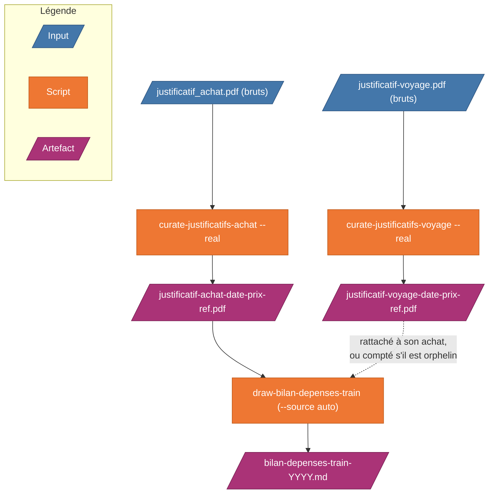

# sncf-trip-proofs

Outils pour déclarer les frais de train au réel, à partir des justificatifs SNCF Connect.

Pour déclarer des frais de train au réel, il faut fournir chaque justificatif avec sa date, son montant et sa référence — et totaliser le tout par mois. SNCF Connect livre des fichiers avec des noms inutilisables (`JustificatifAchat_SNCFCONNECT.pdf`) : impossible de savoir sans les ouvrir à quoi ils correspondent.

Ces outils lisent chaque justificatif, en extraient automatiquement la date, le montant et la référence, renomment les fichiers en conséquence, puis produisent un récapitulatif prêt à soumettre.


```mermaid
flowchart TD
    classDef input    fill:#4477AA,stroke:#2E5580,color:#fff
    classDef script   fill:#EE7733,stroke:#C05A1A,color:#fff
    classDef artifact fill:#AA3377,stroke:#7A2255,color:#fff

    V[/"justificatif-voyage.pdf (bruts)"/]:::input
    A[/"justificatif_achat.pdf (bruts)"/]:::input

    V --> CV["curate-justificatifs-voyage --real"]:::script
    A --> CA["curate-justificatifs-achat --real"]:::script

    CV --> OV[/"justificatif-voyage-date-prix-ref.pdf"/]:::artifact
    CA --> OA[/"justificatif-achat-date-prix-ref.pdf"/]:::artifact

    OA --> B["draw-bilan-depenses-train (--source auto)"]:::script
    OV -.->|"rattaché à son achat,<br/>ou compté s'il est orphelin"| B

    B --> R[/"bilan-depenses-train-YYYY.md"/]:::artifact

    subgraph legend["Légende"]
        direction LR
        Li[/"Input"/]:::input
        Ls["Script"]:::script
        La[/"Artefact"/]:::artifact
    end
```

> **Affichage en local** — VS Code : extension [Markdown Preview Mermaid Support](https://marketplace.visualstudio.com/items?itemName=bierner.markdown-mermaid) + `Cmd+Shift+V`. JetBrains : preview Markdown intégrée.

---

## Sommaire

1. [Installation](#installation)
2. [Utilisation](#utilisation)
3. [Idempotence](#idempotence)
4. [Workflow cloud (zéro copier-coller)](#workflow-cloud-zéro-copier-coller)
5. [Référence](#référence)
6. [Pistes d'évolution](#pistes-dévolution)

---

## Installation

### Dépendances système (OCR + rendu PDF)

```bash
# macOS
brew install tesseract tesseract-lang poppler

# Debian / Ubuntu
sudo apt install tesseract-ocr tesseract-ocr-fra poppler-utils
```

### Dépendances Python (venv recommandé)

```bash
cd sncf-trip-proofs
python3 -m venv .venv
source .venv/bin/activate
pip install -r requirements.txt
```

À chaque nouvelle session terminal : `source .venv/bin/activate` avant de lancer les scripts. Le `.venv/` est local au repo et ignoré par git.

### Configuration des chemins

```bash
cp sncf-trip-proofs/config.example.json sncf-trip-proofs/config.json
```

Éditer `config.json` avec vos chemins réels. Les dossiers `in` et `out` sont créés automatiquement si besoin. Les fichiers sources ne sont **jamais modifiés**.

Un `config.json` illisible ou mal typé **arrête le run** (`[CONFIG]`, code 1) : un
repli silencieux sur `inbox/` ferait tourner la chaîne sur un corpus qui n'est pas
le vôtre et produirait un bilan faux sans le dire. Section absente = repli sur
`inbox/`/`output/`, signalé sur stderr.

```json
{
  "curate-justificatifs-voyage": {
    "in":  ["/Users/alice/Documents/sncf/inbox", "/Users/alice/Documents/sncf/archive"],
    "out": "/Users/alice/Documents/sncf/curated"
  },
  "curate-justificatifs-achat": {
    "in":  ["/Users/alice/Documents/sncf/inbox", "/Users/alice/Documents/sncf/archive"],
    "out": "/Users/alice/Documents/sncf/curated"
  },
  "draw-bilan-depenses-train": {
    "in":  "/Users/alice/Documents/sncf/curated",
    "out": "/Users/alice/Documents/sncf/bilans"
  }
}
```

### Lier son dossier de justificatifs au projet

Plutôt que de recopier des chemins de Drive à rallonge dans `config.json`, on peut
poser un lien symbolique dans le projet et pointer la config dessus :

```bash
ln -s "$HOME/Chemin/Vers/Justificatifs SNCF/inbox"   sncf-trip-proofs/inbox
ln -s "$HOME/Chemin/Vers/Justificatifs SNCF/curated" sncf-trip-proofs/curated
```

Les scripts traversent le lien sans rien savoir de particulier : le parcours
récursif des sources le suit, et le garde-fou « sortie et source imbriquées »
résout les chemins réels avant de comparer — un lien qui ferait pointer `in` et
`out` sur le même dossier déclenche toujours le `[REFUS]`.

**Ce qu'un lien ne fait pas : ouvrir des droits.** macOS résout la cible avant
d'autoriser l'accès. Un lien vers `~/Documents`, `~/Desktop`, `~/Downloads`,
iCloud Drive ou `~/Library/CloudStorage/…` rend `Operation not permitted`
exactement comme le chemin direct, tant que le binaire qui exécute les scripts
n'a pas l'**Accès complet au disque** (Réglages Système → Confidentialité et
sécurité). Vérifié : lien créé, lecture refusée à travers lui.

Deux façons de faire tourner les scripts sans accorder cet accès :

| Approche | Effet |
|---|---|
| Placer le corpus hors zone protégée — `~/sncf-justificatifs/`, un point de montage Drive personnalisé, ou le projet lui-même | Aucun droit spécial requis, les scripts lisent normalement |
| Accorder l'Accès complet au disque au terminal | Le corpus peut rester dans le Drive ou `Documents` |

**Côté sécurité**, le lien n'ajoute aucun droit, donc aucun risque de ce côté.
Le vrai risque est le versionnement : un justificatif est **nominatif** — nom,
trajets, dates — et un lien commité expose en plus l'arborescence locale. Le
`.gitignore` couvre donc `inbox`, `output`, `curated`, `bilans`, `archive` et
tout `*.pdf`, liens symboliques compris. À vérifier après avoir créé le lien :

```bash
git check-ignore -v sncf-trip-proofs/inbox   # doit afficher la règle qui l'ignore
git status --porcelain sncf-trip-proofs      # ne doit rien montrer d'inattendu
```

`in` accepte un chemin ou une **liste** de chemins, parcourus récursivement : le
corpus d'un script couvre `inbox/` **et** `archive/`, sinon archiver un
justificatif le retirerait des sources et le bilan perdrait l'historique. Voir
[Idempotence](#idempotence).

> ⚠️ **Avant le premier run**, vérifier que `config.json` ne contient plus les
> chemins placeholder `/Users/alice/…`. Les dossiers `in`/`out` étant auto-créés,
> un chemin oublié à `alice` ne crash pas — il crée silencieusement une
> arborescence au mauvais endroit.
>
> ```bash
> grep -q "alice" sncf-trip-proofs/config.json && echo "⚠️ placeholders restants"
> ```

---

## Utilisation

```bash
# 1. Organiser les justificatifs d'achat (JustificatifAchat_SNCFCONNECT.pdf)
python3 sncf-trip-proofs/curate-justificatifs-achat/curate-justificatifs-achat.py          # dry-run
python3 sncf-trip-proofs/curate-justificatifs-achat/curate-justificatifs-achat.py --real   # applique
#   ajouter --yes pour confirmer la regénération sans prompt (cron, launchd, wrapper)

# 2. Organiser les justificatifs de voyage (justificatif-voyage-*.pdf)
python3 sncf-trip-proofs/curate-justificatifs-voyage/curate-justificatifs-voyage.py          # dry-run
python3 sncf-trip-proofs/curate-justificatifs-voyage/curate-justificatifs-voyage.py --real   # applique

# 3. Générer le bilan
python3 sncf-trip-proofs/draw-bilan-depenses-train/draw-bilan-depenses-train.py
```

Le bilan `bilan-depenses-train-YYYY.md` est généré dans le dossier `out` configuré.

### Quel justificatif compte dans le total

Un même trajet donne souvent **deux** documents, un justificatif d'achat et un
justificatif de voyage, dont les références appartiennent à des espaces disjoints
(`1917346212-20260504` contre `ne3erm`). Comptés tous les deux, ils doublent la
dépense déclarée. Le bilan les rapproche donc, en mode `auto` par défaut :

| Cas | Traitement |
|---|---|
| Justificatif de voyage dont la date tombe dans la plage d'une commande d'achat et dont le montant tient dans son total | Rattaché — la dépense n'est comptée qu'une fois. Un aller-retour acheté en une commande absorbe ainsi ses deux justificatifs de voyage |
| Justificatif de voyage qu'aucune commande ne couvre | Compté comme trajet : c'est un trajet dont le justificatif d'achat n'a jamais été téléchargé |
| Commande partiellement couverte (un seul justificatif de voyage sur deux, ou montant non comparable) | Rattaché quand même, total inchangé, mais **signalé** dans le bilan pour arbitrage manuel |

`--source achat`, `--source voyage` ou `--source tous` forcent le comportement.
Le détail est dans la section « Réconciliation » de chaque bilan.

### Justificatif de voyage — délai de 60 jours

Le justificatif de voyage n'est téléchargeable que **60 jours** après le départ,
et pas avant 24 à 48 h après le dernier trajet. Passé ce délai il n'est plus
récupérable : aucun formulaire ni demande au service client ne permet de le
rattraper.

**Que faire si le délai est dépassé** — se replier sur le **justificatif
d'achat**, disponible jusqu'à **13 mois** après la date d'arrivée du voyage,
depuis « Billets » → le trajet → « Justificatifs d'achat et de voyage ». C'est la
source que le bilan privilégie par défaut, précisément parce qu'elle survit dix
fois plus longtemps.

Au-delà de 13 mois, plus aucun document n'est récupérable côté SNCF Connect.
D'où la règle : **télécharger dans les jours qui suivent le trajet**, pas au
moment de déclarer.

À savoir aussi :

- Le justificatif de voyage n'existe que pour les billets achetés sur le site ou
  l'appli SNCF Connect.
- Eurostar, OUIGO, FlixBus et BlaBlaCar Bus n'en délivrent pas — pour ces
  trajets, seul le justificatif d'achat existe.
- Sans compte : se déconnecter, onglet « Billets », référence de dossier
  (`RGTPLS`) + nom de la commande.

Sources : [justificatif de voyage](https://www.sncf-connect.com/aide/vos-justificatifs-de-voyage)
et [justificatif d'achat](https://www.sncf-connect.com/aide/le-justificatif-d-achat),
FAQ SNCF Connect, consultées le 2026-08-20.

Pour enchaîner les 3 commandes en une seule, archiver `inbox/` automatiquement et brancher le tout sur un dossier cloud synchronisé, voir [Workflow cloud](#workflow-cloud-zéro-copier-coller) ci-dessous.

---

## Idempotence

`curated/` et `bilans/` sont **entièrement dérivés** : chaque `--real` les
reconstruit à partir du corpus de sources. Deux propriétés en découlent, et ce
sont elles qu'il faut vérifier après toute modification :

```bash
# 1. rejouer ne change rien
sncf-run.sh && sncf-run.sh          # aucun diff sur curated/ et bilans/

# 2. les sorties sont reconstructibles
rm -rf "$DRIVE/curated" "$DRIVE/bilans" && sncf-run.sh   # état identique
```

Les deux sont couvertes par `tests/test_idempotence.py`, archivage de l'inbox
entre deux runs inclus.

Ce qui les rend vraies : **les sources ne quittent jamais le domaine**.
`archive/` n'est pas un cimetière, c'est le corpus — d'où sa présence dans le
`in` des deux scripts `curate-*`. Ranger un justificatif d'`inbox/` vers
`archive/2026-08/` ne change rien à ce que produit le run suivant. À l'inverse,
supprimer un fichier d'`archive/` le retire du bilan : c'est la seule opération
destructrice du système.

Corollaire utile : un correctif de parsing se repropage sur tout l'historique au
run suivant, sans manipulation.

**Coût** : chaque run relit tout le corpus. Le texte extrait est mis en cache
dans `curated/.sncf-text-cache.json`, indexé par checksum du PDF — un fichier
déjà vu n'est jamais réanalysé, OCR compris. Ce cache est dérivé lui aussi :
le supprimer ne change que la durée du prochain run.

---

## Workflow cloud (zéro copier-coller)

Si vos justificatifs vivent sur un cloud (Google Drive, Dropbox, iCloud Drive, OneDrive…), pointez `config.json` directement sur le dossier monté localement par le client desktop. Les scripts lisent/écrivent dans le cloud sans copie manuelle.

### Setup Google Drive for Desktop

> ⚠️ **Avant de copier-coller** les chemins ci-dessous : remplacer `<email>`
> par votre adresse Google réelle (sinon `config.json` contient littéralement
> `<email>` et les scripts échouent avec `Path does not exist`). Pour trouver
> le nom exact de votre point de montage :
>
> ```bash
> ls ~/Library/CloudStorage/ | grep GoogleDrive
> # → GoogleDrive-prenom.nom@gmail.com
> ```

1. **Installer le client** : <https://www.google.com/drive/download/>, se connecter, choisir **« Streamer les fichiers »** (économise du disque).
2. **Localiser le point de montage** :
   - macOS récent : `~/Library/CloudStorage/GoogleDrive-<email>/Mon Drive/`
   - macOS ancien : `/Volumes/GoogleDrive/Mon Drive/`
   - Windows : `G:\Mon Drive\`
3. **Créer la structure** dans le Drive (Finder/Explorer ou navigateur) :
   ```
   Justificatifs SNCF/
   ├── inbox/      ← PDFs bruts téléchargés depuis SNCF Connect
   ├── archive/    ← PDFs bruts déjà traités — rangés, toujours sources
   ├── curated/    ← PDFs renommés (dérivé, reconstructible)
   └── bilans/     ← bilans .md (dérivé, reconstructible)
   ```
4. **Marquer offline** : clic droit sur `Justificatifs SNCF/` → « Disponible hors connexion ». Sans ça, Tesseract OCR re-télécharge chaque PDF à chaque accès, lent et fragile.
5. **Configurer le navigateur** pour télécharger directement dans `inbox/` :
   - Chrome/Brave : Réglages → Téléchargements → Emplacement
   - Safari : Réglages → Général → Emplacement de téléchargement
   - Firefox : Réglages → Général → Fichiers et applications
6. **Éditer `config.json`** avec les chemins du Drive :
   ```json
   {
     "curate-justificatifs-achat": {
       "in":  ["/Users/<vous>/.../Justificatifs SNCF/inbox",
               "/Users/<vous>/.../Justificatifs SNCF/archive"],
       "out": "/Users/<vous>/.../Justificatifs SNCF/curated"
     },
     "curate-justificatifs-voyage": { "in": ["...inbox", "...archive"], "out": "...curated" },
     "draw-bilan-depenses-train":   { "in": "...curated", "out": "...bilans" }
   }
   ```

   `archive/` figure dans `in` : le wrapper y range les justificatifs traités,
   ils restent le corpus du run suivant.

À partir de là : télécharger un PDF SNCF → il atterrit dans le Drive → lancer les scripts depuis le venv → outputs synchronisés automatiquement.

### Alternative — Dropbox / iCloud Drive / OneDrive

Même principe, seul le point de montage change :

| Provider | Point de montage typique (macOS) | Garder offline |
|---|---|---|
| Dropbox | `~/Dropbox/` | Préférences → Sync → « Sync sélective » → tout cocher |
| iCloud Drive | `~/Library/Mobile Documents/com~apple~CloudDocs/` | Décocher « Optimiser stockage Mac » |
| OneDrive | `~/OneDrive/` | Clic droit → « Toujours conserver sur cet appareil » |

Adapter les chemins dans `config.json` au point de montage choisi. Les étapes 3 à 6 ci-dessus restent valables à l'identique.

### Wrapper `sncf-run.sh` (un seul script pour tout enchaîner)

Pour éviter de taper les 3 commandes à la suite, et archiver automatiquement `inbox/` après chaque run.

**Installation** :

```bash
mkdir -p ~/.local/bin
# coller le script ci-dessous dans ce fichier, puis :
chmod +x ~/.local/bin/sncf-run.sh

# Vérifier que ~/.local/bin est dans le PATH
echo $PATH | tr ':' '\n' | grep -q "$HOME/.local/bin" || \
  echo 'export PATH="$HOME/.local/bin:$PATH"' >> ~/.zshrc   # ou ~/.bashrc

# Adapter REPO et le default DRIVE en tête du script avant le premier run.
# Lancer ensuite depuis n'importe quel terminal :
sncf-run.sh
```

**Script** :

```bash
#!/usr/bin/env bash
# ~/.local/bin/sncf-run.sh — adapter REPO et DRIVE puis chmod +x
set -euo pipefail

# Logs (XDG-conforme — macOS / Linux / Git Bash & WSL sur Windows)
LOG_DIR="${XDG_DATA_HOME:-$HOME/.local/share}/sncf-trip-proofs"
mkdir -p "$LOG_DIR"
exec > >(tee -a "$LOG_DIR/sncf-run.log") 2>&1
echo "=== $(date '+%Y-%m-%d %H:%M:%S') === sncf-run start ==="

# Lock non-bloquant : refus si une instance tourne deja
LOCKFILE="${TMPDIR:-/tmp}/sncf-run.lock"
if ! ( set -o noclobber; echo "$$" > "$LOCKFILE") 2>/dev/null; then
  echo "sncf-run deja en cours (PID $(cat "$LOCKFILE" 2>/dev/null))" >&2; exit 1
fi
trap 'rm -f "$LOCKFILE"' EXIT

REPO="$HOME/Projects/toolbox/sncf-trip-proofs"
DRIVE="${SNCF_DRIVE:-$HOME/Library/CloudStorage/GoogleDrive-<email>/Mon Drive/Justificatifs SNCF}"
INBOX="$DRIVE/inbox"
CURATED="${SNCF_CURATED:-$DRIVE/curated}"
ARCHIVE="$DRIVE/archive/$(date +%Y-%m)"

# Snapshot checksums AVANT run, dans un fichier "<sha256>  <chemin>".
# Ni mapfile ni declare -A : le /bin/bash d'Apple est en 3.2, et c'est lui que
# cron/launchd lance avec un PATH minimal.
SNAPSHOT=$(mktemp)
trap 'rm -f "$LOCKFILE" "$SNAPSHOT"' EXIT
mkdir -p "$INBOX"
find "$INBOX" -maxdepth 1 -type f -name '*.pdf' -exec shasum -a 256 {} \; > "$SNAPSHOT"

# Les scripts tournent meme si inbox/ est vide : curated/ et bilans/ sont
# derives du corpus (inbox/ + archive/) et doivent rester reconstructibles.
cd "$REPO"
[[ -x "$REPO/.venv/bin/python3" ]] && PY="$REPO/.venv/bin/python3" || PY="python3"
"$PY" curate-justificatifs-achat/curate-justificatifs-achat.py --real --yes
"$PY" curate-justificatifs-voyage/curate-justificatifs-voyage.py --real --yes
"$PY" draw-bilan-depenses-train/draw-bilan-depenses-train.py

# Range les sources du run — elles restent dans le corpus via "in"
if [[ -s "$SNAPSHOT" ]]; then
  # Seulement celles dont le contenu se retrouve dans curated/
  CURATED_SUMS=$(find "$CURATED" -maxdepth 1 -type f -name '*.pdf' \
                 -exec shasum -a 256 {} \; | awk '{print $1}' | sort -u)
  mkdir -p "$ARCHIVE"
  while IFS= read -r line; do
    sum="${line%% *}"
    file="${line#*  }"
    if grep -qFx "$sum" <<<"$CURATED_SUMS"; then
      mv "$file" "$ARCHIVE/"
    else
      echo "non-archive : $(basename "$file")" >&2
    fi
  done < "$SNAPSHOT"
else
  echo "inbox vide - sorties reconstruites depuis archive/"
fi
```

Propriétés :

| Propriété | Garantie |
|---|---|
| **Snapshot avant run** | Un PDF ajouté pendant l'exécution n'est pas archivé par erreur, sera traité au run suivant. |
| **Inbox vide ≠ rien à faire** | Les scripts tournent quand même : `curated/` et `bilans/` sont dérivés du corpus et restent reconstructibles après un `rm -rf`. |
| **Archive sélective par checksum** | Seuls les PDFs dont le contenu se retrouve dans `curated/` sont archivés. Un échec OCR/parsing reste visible dans `inbox/` — pas d'erreur silencieuse. |
| **Archive uniquement si tout réussit** (`set -e`) | Un crash dans un script Python préserve les sources, on relance, les doublons sont gérés. |
| **Exécution non-interactive** | `--yes` confirme la regénération sans prompt. Sans terminal et sans `--yes`, le script s'arrête (code 1) au lieu de bloquer sur `input()`. |
| **Venv auto-détecté** | Utilise `.venv/bin/python3` si présent, sinon `python3` du `PATH`. |
| **Compatible bash 3.2** | Ni `mapfile` ni `declare -A` : tourne sous le `/bin/bash` d'Apple, celui que cron et launchd lancent avec un PATH minimal. |
| **Lock anti double-exécution** | Pattern noclobber + PID, portable (`flock` absent de macOS). Trap `EXIT` nettoie le lock même en cas de crash. |
| **Logs cross-platform** | `$XDG_DATA_HOME/sncf-trip-proofs/sncf-run.log` ou `~/.local/share/sncf-trip-proofs/sncf-run.log`. Fonctionne sur macOS, Linux, Git Bash/WSL sur Windows. Indispensable une fois branché à un Shortcut ou cron. Croissance illimitée : à rotater à la main (`logrotate` ou troncature). |

### Clôture annuelle (`sncf-close-year`)

Les sources restant dans le corpus, un bilan est **recalculé à chaque run** —
c'est ce qui garantit qu'il reflète toujours l'ensemble des justificatifs. Clore
une année, c'est donc figer une **copie de référence** du bilan déclaré, pas
retirer des sources.

**Politique** : début février N+1 (buffer de deux mois pour les retards de
décembre), copier le bilan de l'année N dans `archive/closed-N/`. Toute
divergence ultérieure devient visible par un simple `diff`.

Ajouter cette fonction à `~/.zshrc` (ou `~/.bashrc`) :

```bash
sncf-close-year() {
  local YR="$1"
  local DRIVE="${SNCF_DRIVE:-$HOME/Library/CloudStorage/GoogleDrive-<email>/Mon Drive/Justificatifs SNCF}"
  local DEST="$DRIVE/archive/closed-$YR"
  mkdir -p "$DEST"
  cp "$DRIVE/bilans/bilan-depenses-train-$YR.md" "$DEST/" || return 1
  echo "annee $YR figee dans $DEST"
}

# verifier plus tard qu'un bilan declare n'a pas derive
sncf-check-year() {
  local YR="$1"
  local DRIVE="${SNCF_DRIVE:-$HOME/Library/CloudStorage/GoogleDrive-<email>/Mon Drive/Justificatifs SNCF}"
  diff "$DRIVE/archive/closed-$YR/bilan-depenses-train-$YR.md" \
       "$DRIVE/bilans/bilan-depenses-train-$YR.md" && echo "$YR conforme au bilan declare"
}
```

Usage :

```bash
sncf-close-year 2026   # debut fevrier 2027
sncf-check-year 2026   # a tout moment ensuite
```

Propriétés :
- **Idempotent** : re-jouer récrit la même copie.
- **Rattrapage tardif visible** : un justificatif 2026 arrivant en mai 2027 est
  traité normalement, le bilan 2026 est recalculé, et `sncf-check-year 2026`
  montre exactement ce qui a changé par rapport au bilan déclaré. Pas de dérive
  silencieuse, dans un sens comme dans l'autre.
- **Aucune source déplacée** : la seule opération destructrice du système reste
  la suppression manuelle d'un fichier d'`archive/`.

---

## Référence

### Structure du projet

```
sncf-trip-proofs/
├── curate-justificatifs-achat/          ← organise les justificatifs d'achat
│   ├── inbox/                           ← déposer les PDFs bruts d'achat ici
│   ├── output/                          ← PDFs renommés (dérivé, regénéré à chaque --real)
│   ├── curate-justificatifs-achat.py    ← script d'organisation
│   ├── docs/specs/                      ← spécifications internes
│   └── README.md                        ← doc détaillée (formats, comportement, dépannage)
│
├── curate-justificatifs-voyage/         ← organise les justificatifs de voyage
│   ├── inbox/                           ← déposer les PDFs bruts de voyage ici
│   ├── output/                          ← PDFs renommés (dérivé, regénéré à chaque --real)
│   ├── curate-justificatifs-voyage.py   ← script d'organisation
│   ├── docs/specs/                      ← spécifications internes
│   └── README.md                        ← doc détaillée (formats, comportement, dépannage)
│
├── draw-bilan-depenses-train/           ← génère le bilan chiffré
│   ├── draw-bilan-depenses-train.py     ← script de génération du bilan Markdown
│   └── docs/specs/                      ← spécifications internes
│
├── tests/                               ← tests fonctionnels et d'idempotence (chaîne complète)
├── sncf_common.py                       ← socle partagé (config, OCR, parseurs, dédoublonnage)
├── requirements.txt                     ← dépendances Python pinnées
├── config.example.json                  ← template à copier en config.json
└── README.md                            ← ce fichier
```

### Tests

```bash
python3 -m pytest -q          # depuis sncf-trip-proofs/
```

157 tests : parsing (date, montant, référence, TCN), génération du bilan, et
tests fonctionnels de bout en bout (`tests/`) sur les chaînes inbox → output et
justificatifs → bilans. Aucun vrai PDF requis — l'extraction de texte est
substituée : un changement de gabarit chez SNCF Connect ne serait donc pas vu
par la CI, seul un run réel le révèle.

La CI GitLab (`.gitlab-ci.yml`, job `tests`) rejoue la suite à chaque push et sur
chaque merge request. Image `python:3.12` — la variante `-slim` n'embarque pas
`shasum`, ce qui ferait skipper silencieusement les tests du wrapper.

### Formats de noms produits

**Justificatifs d'achat** (`curate-justificatifs-achat`) :

```
justificatif-achat-<DATES>-<PRIX>-<REF>[-N].pdf
```

```
20260402_0701_JustificatifAchat_SNCFCONNECT.pdf
    → justificatif-achat-20260402-18-50ttc-1917346212-20260504.pdf

20260423_JustificatifAchat_SNCFCONNECT.pdf   (4 tickets, 2 jours)
    → justificatif-achat-20260423-20260424-57-00ttc-1480540391-20260504.pdf
```

**Justificatifs de voyage** (`curate-justificatifs-voyage`) :

```
justificatif-voyage-<DATE>-<PRIX>-<REF>[-<TCN>][-N].pdf
```

```
justificatif-voyage-brut.pdf
    → justificatif-voyage-20260402-18-50ttc-ne3erm-016487606.pdf
```

### Sortie du bilan (exemple console)

```
Lecture de : /…/curated
22 fichier(s) PDF trouvé(s)

✓ 22 trajet(s) extrait(s) depuis 22 ticket(s)
  source 'achat' : 22 PDF trouvé(s), 22 retenu(s), 0 d'un autre type, 0 en double, 0 en erreur

── Détail des trajets ──────────────────────────────

  16/03/2026  (1 trajet(s) — 15,60 €)
    • [calc] 15,60 €  ←  justificatif-voyage-20260316-15-60ttc-D56qej.pdf

  02/04/2026  (2 trajet(s) — 37,00 €)
    • [calc] 18,50 €  ←  justificatif-voyage-20260402-18-50ttc-ne3erm-016487606.pdf
    • [calc] 18,50 €  ←  justificatif-voyage-20260402-18-50ttc-ne3t6x-016487554.pdf
  …

✓ Bilan généré : bilan-depenses-train-2026.md
  → /…/curate-justificatifs-voyage/output/bilan-depenses-train-2026.md
```

`[PDF]` = prix extrait du PDF (multi-tickets achat). `[calc]` = montant du nom de fichier.

### Cas particuliers

| Situation | Comportement |
|---|---|
| PDF illisible (corrompu) | Erreur en console + listé dans le bilan |
| Nom non reconnu | Tentative fallback lecture PDF |
| Champ manquant après fallback | Erreur en console + listé dans le bilan |
| Dossier IN vide | Message "Rien à traiter", pas de fichier généré |
| Plusieurs années mélangées | Un fichier bilan par année |
| Fichiers non-PDF dans IN | Ignorés silencieusement |
| Justificatif déplacé d'`inbox/` vers `archive/` | Aucun effet : `archive/` fait partie du corpus, la sortie du run suivant est identique |
| `curated/` ou `bilans/` supprimés | Reconstruits à l'identique au run suivant depuis le corpus |
| Correctif de parsing livré | Se repropage sur tout l'historique au run suivant |
| `out` partagé par achat et voyage | Chaque script ne supprime que ses propres `justificatif-<type>-*.pdf` — l'autre sortie et les bilans sont préservés |
| `out` égal à `in` dans `config.json` | `[REFUS]` — le script s'arrête sans rien supprimer |
| Un trajet a un justificatif d'achat **et** un de voyage | `[RAPPROCHÉ]` — la dépense n'est comptée qu'une fois. Sans ce rapprochement, elle serait déclarée en double |
| Aller-retour acheté en une commande, avec un justificatif de voyage par sens | `[RAPPROCHÉ]` sur la commande — les deux voyages consomment son total, aucun n'est orphelin |
| Trajet dont seul le justificatif de voyage existe (achat jamais téléchargé) | `[VOYAGE ORPHELIN]` — compté comme trajet, il reste dans le total |
| Commande partiellement couverte par ses justificatifs de voyage | `[À VÉRIFIER]` — listé dans le bilan, à relire à la main |
| Montant à quatre chiffres (`1 234,50 €`) | Séparateur de milliers normalisé avant parsing — sans ça, `234,50 €` était retenu |
| Avoir ou remboursement (`-12,00 €`) | Non compté comme une dépense : le champ montant ressort manquant, donc visible |
| `config.json` illisible | `[CONFIG]` — le run s'arrête, aucun repli silencieux |
| Deux sources au contenu identique | `[DOUBLON SOURCE]` — seul le plus ancien est gardé |
| Deux fichiers → même nom cible | `[CONFLIT NOM]` — checksum puis numérotation `_1`, `_2`, … |
| Même commande achat re-téléchargée | `[DOUBLON]` dans le bilan — second fichier ignoré |

---

## Pistes d'évolution

| Sujet | Pourquoi | Direction |
|---|---|---|
| **Rapprochement sur les valeurs** | Le mode `auto` rapproche achat et voyage sur (date, montant) faute de référence commune. Quand le montant de l'achat vient d'une répartition à parts égales, seule la date rapproche : la ligne est signalée, mais l'arbitrage reste humain. | Rapprocher sur une donnée réellement commune si SNCF Connect en expose une (numéro de dossier présent dans les deux PDF), ce qui supprimerait l'heuristique. |
| **Séparation perso / pro** | Le corpus est global : un trajet personnel entre dans le bilan comme les autres, et rien ne permet de l'en sortir. | Convention de sous-dossier dans `curated/`, ou fichier d'exclusion listant des références. |
| **Export CSV / XLSX du bilan** | Le `.md` couvre les frais réels perso (justificatifs sur demande). Pour les notes de frais entreprise demandant un upload tabulaire, copier-coller manuel à court terme. | Étendre `draw-bilan-depenses-train` pour produire `.csv`/`.xlsx` en parallèle (via `csv` stdlib ou `openpyxl`). |
| **Backup de `archive/`** | `archive/closed-YYYY/` doit être conservée 6 ans (délai de reprise fiscal FR). Un seul cloud = risque (compte suspendu, sync foireux, suppression manuelle). | `rclone copy` mensuel vers un second backend (autre cloud, disque externe, Backblaze B2). Cross-platform. |
| **Déclenchement automatique** | Aujourd'hui le wrapper est lancé manuellement depuis le terminal. | Raccourci macOS (Shortcuts) ou cron/launchd pour un déclenchement zéro action. Logs déjà branchés sur fichier pour observabilité. |
